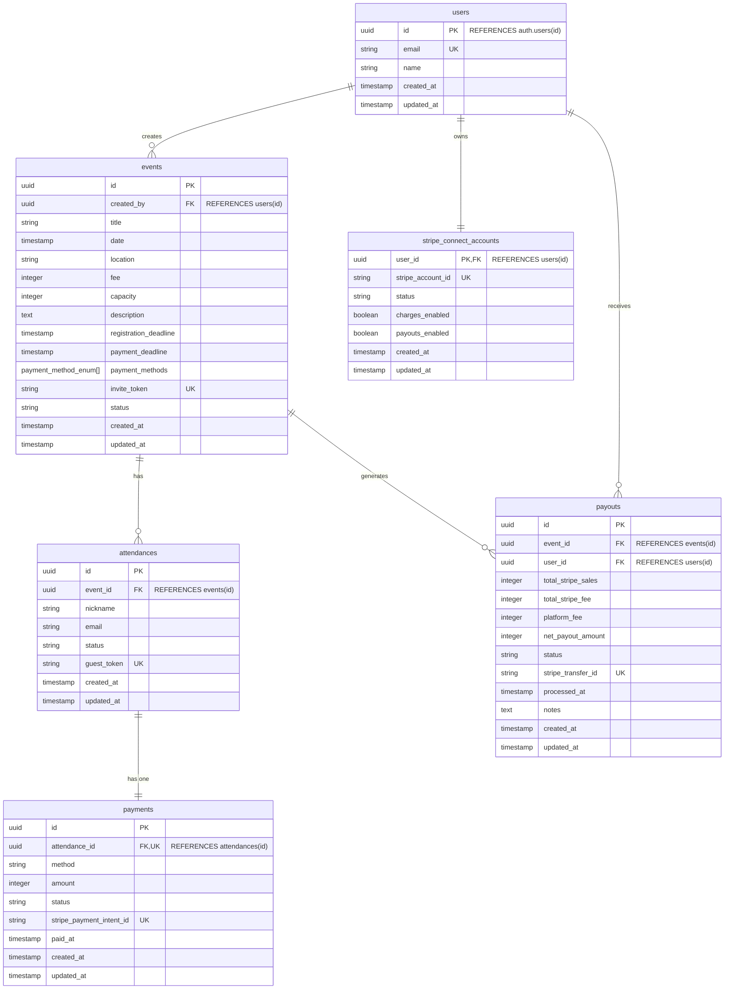

# EventPay - イベント参加費用管理システム

EventPay は、Next.js、TypeScript、Supabase、Stripe を使用して構築されたイベント参加費用管理システムです。大学サークルや社会人サークルなどの小規模コミュニティにおける会計担当者の負担を軽減することを目的としています。

## 主な機能

### 運営者向け

- **イベント管理**: イベントの作成、編集、削除、招待リンクの発行
- **参加者管理**: 参加状況・決済状況のリアルタイム確認、現金決済のステータス更新
- **収益管理**: イベント売上の確認、Stripe Connect オンボーディング、送金履歴の表示

### 参加者向け

- **簡単な参加表明**: 招待リンクからニックネーム入力のみで参加登録
- **柔軟な決済**: Stripe（クレジットカード）または現金での支払い選択
- **参加情報の確認・変更**: 専用URLから自身の参加状況を管理


### 技術スタック

| カテゴリ              | 技術・サービス  | 備考                                  |
| --------------------- | --------------- | ------------------------------------- |
| **フレームワーク**    | Next.js (React) | App Router を利用したフルスタック開発 |
| **言語**              | TypeScript      | 型安全性の確保                        |
| **BaaS**              | Supabase        | 認証、データベース(PostgreSQL)        |
| **決済**              | Stripe          | Stripe Connect Express を利用         |
| **UI**                | Tailwind CSS    | スタイリング                          |
| **UI コンポーネント** | Shadcn/ui       | アクセシビリティの高いコンポーネント  |
| **状態管理**          | Zustand         | シンプルなクライアント状態管理        |
| **ホスティング**      | Vercel          |                                       |
| **メール配信**        | Resend          | トランザクションメール送信            |

## 開発環境のセットアップ

### 前提条件

以下のツールがインストールされている必要があります：

- Node.js v22.15.0 以上（推奨：nvm 使用）
- npm または yarn
- Git
- Supabase CLI
- Stripe CLI（Stripe 連携をテストする場合）

### セットアップ手順

1. **リポジトリのクローン**

   ```bash
   git clone <repository-url>
   cd event-pay
   ```

2. **Node.js のバージョン設定（nvm を使用する場合）**

   ```bash
   nvm install
   nvm use
   ```

3. **依存関係のインストール**

   ```bash
   npm install
   ```

4. **環境変数の設定**

   ```bash
   cp .env.example .env.local
   ```

   `.env.local`ファイルを編集し、必要な環境変数を設定してください。

5. **Supabase のセットアップ**

   ```bash
   # Supabase CLIのインストール（まだの場合）
   # 推奨: devDependencyとしてインストール
   npm install supabase --save-dev

   # Supabaseローカル環境の起動
   npx supabase start

   # データベースのマイグレーション実行
   npm run db:migrate

   # シードデータの投入（必要な場合）
   npm run db:seed
   ```

6. **開発サーバーの起動**

   ```bash
   npm run dev
   ```

   [http://localhost:3000](http://localhost:3000) でアプリケーションにアクセスできます。

## 利用可能なスクリプト

- `npm run dev` - 開発サーバーの起動
- `npm run build` - プロダクションビルドの作成
- `npm run start` - プロダクションサーバーの起動
- `npm run lint` - ESLint の実行
- `npm run typecheck` - TypeScript の型チェック
- `npm run test` - テストの実行
- `npm run test:watch` - テストの監視モード
- `npm run test:coverage` - カバレッジレポート付きテスト
- `npm run test:security` - セキュリティテストの実行
- `npm run db:reset` - データベースのリセット
- `npm run db:migrate` - マイグレーションの実行
- `npm run db:seed` - シードデータの投入
- `npm run stripe:listen` - Stripe Webhook のローカルリスナー起動

## プロジェクト構成

```
event-pay/
├── app/                  # Next.js App Router
│   ├── (auth)/           # 認証関連ページ
│   ├── (dashboard)/      # 認証後ダッシュボード
│   └── api/              # APIエンドポイント
├── components/           # UIコンポーネント
├── lib/                  # ライブラリ、ユーティリティ
│   ├── supabase/         # Supabaseクライアント設定
│   └── stripe/           # Stripeクライアント設定
├── docs/                 # プロジェクトドキュメント
│   └── v2/               # 最新ドキュメント
└── supabase/             # Supabaseマイグレーション
```

## データベース設計 (ER図)



## 環境変数

以下の環境変数を`.env.local`に設定する必要があります：

### Supabase 設定

- `NEXT_PUBLIC_SUPABASE_URL` - Supabase プロジェクトの URL
- `NEXT_PUBLIC_SUPABASE_ANON_KEY` - Supabase の匿名キー
- `SUPABASE_SERVICE_ROLE_KEY` - Supabase のサービスロールキー

### Stripe 設定

- `STRIPE_SECRET_KEY` - Stripe のシークレットキー SK
- `STRIPE_WEBHOOK_SECRET` - Stripe Webhook シークレット
- `NEXT_PUBLIC_STRIPE_PUBLISHABLE_KEY` - Stripe の公開可能キー

### アプリケーション設定

- `NEXT_PUBLIC_APP_URL` - アプリケーションの URL（デフォルト：http://localhost:3000）
- `NEXT_PUBLIC_SITE_URL` - アプリケーションのURL
- `STRIPE_SECRET_KEY` - Stripeのシークレットキー
- `STRIPE_WEBHOOK_SECRET` - StripeのWebhookシークレットキー
- `RESEND_API_KEY` - ResendのAPIキー
- `COOKIE_SECRET` - Cookieの署名・暗号化に使用する32文字以上の秘密鍵

## Learn More

- [Next.js Documentation](https://nextjs.org/docs)
- [Supabase Documentation](https://supabase.com/docs)
- [Stripe Documentation](https://stripe.com/docs)
- [TypeScript Documentation](https://www.typescriptlang.org/docs/)
