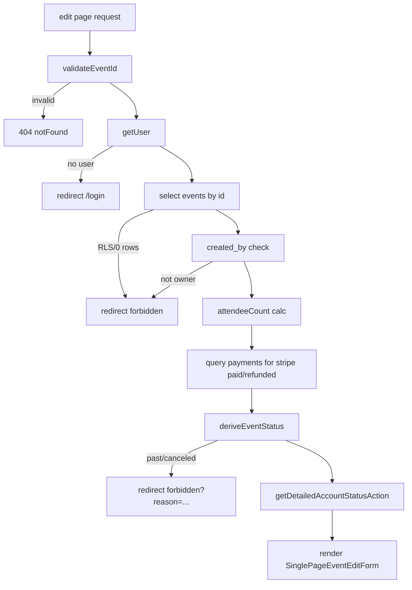
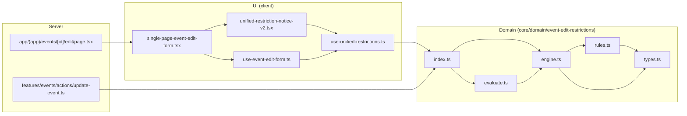

## 設計書パート

### 1. 目的・概要
- **[目的]**  
  イベント編集において、参加者/決済の状況に応じて「変更してはいけない項目」を統一ルールで判定し、  
  - **UI（入力欄の `disabled`）での予防**  
  - **サーバ側（更新Action）での強制拒否**  
  の二層で整合的に担保する。
- **[基本仕様（v2の位置づけ）]**  
  「イベント編集制限 v2」は `core/domain/event-edit-restrictions` にある **ルール駆動の制限エンジン**。  
  フロントでは `useUnifiedRestrictions` でフォーム入力の変化に追随して制限状態を再評価し、[isFieldEditable()](cci:1://file:///home/tkhs/code/event-pay/core/domain/event-edit-restrictions/index.ts:65:0-72:1) を使って各フィールドの編集可否を制御する。  
  サーバでは [evaluateEventEditViolations()](cci:1://file:///home/tkhs/code/event-pay/core/domain/event-edit-restrictions/evaluate.ts:72:0-108:1) を使って **パッチ（実際に更新しようとしているフィールド）に対する違反**を検出し、更新を拒否する。

---

### 2. 要件整理（制限条件の一覧）
#### 2.1 ページレベル（画面遷移/アクセス制御）
`app/(app)/events/[id]/edit/page.tsx`
- **[認証必須]**  
  未ログインは `/login` へ `redirect`
- **[イベントID形式不正は404]**  
  `validateEventId()` が失敗したら `notFound()`
- **[イベント取得できない/権限なしは403相当へ]**  
  `events` の取得で `PGRST301`（RLS拒否）, `PGRST116`（0件）, または `!event` の場合 `redirect(/forbidden)`
- **[作成者本人のみ編集可]**  
  `event.created_by !== user.id` なら `redirect(/forbidden)`
- **[開催済み/キャンセル済みは編集画面自体を禁止]**  
  `deriveEventStatus()` により `past`/`canceled` の場合 `redirect(/forbidden?reason=...)`

#### 2.2 フィールドレベル（編集可否/注意喚起）: v2ドメインルール
[core/domain/event-edit-restrictions/rules.ts](cci:7://file:///home/tkhs/code/event-pay/core/domain/event-edit-restrictions/rules.ts:0:0-0:0)

- **[構造的制限（structural）: 絶対変更不可]**
  - **`fee`**: `hasStripePaid === true`（Stripe決済済み参加者がいる）なら変更不可  
    ルール: `STRIPE_PAID_FEE_RESTRICTION`
  - **`payment_methods`**: `hasAttendees === true`（参加者がいる）場合  
    - **追加は許可**  
    - **既存の決済方法の解除は不可**（元の `payment_methods` にあった要素が新しい `payment_methods` から消えるとNG）  
    ルール: `ATTENDEE_PAYMENT_METHODS_RESTRICTION`

- **[条件的制限（conditional）: 条件下で変更不可]**
  - **`capacity`**: `hasAttendees === true` かつ、新しい定員が参加者数未満ならNG  
    - `capacity` が未設定/無制限扱い（`null` や `0` 等）は許可（ドメイン側は `0` or `null` を「制限なし」寄りで扱う）  
    ルール: `ATTENDEE_COUNT_CAPACITY_RESTRICTION`

- **[注意事項（advisory）: 変更可能だが警告]**
  - **重要項目の変更注意**（参加者がいる場合、`title/date/location/fee` のいずれかに変更がある）  
    ルール: `ATTENDEE_IMPACT_ADVISORY`
  - **無料イベントなのに決済方法が設定されている注意**（`fee === 0` かつ `payment_methods.length > 0`）  
    ルール: `FREE_EVENT_PAYMENT_ADVISORY`
  - **有料イベントなのに決済方法未選択の注意**（`fee > 0` かつ `payment_methods.length === 0`）  
    ルール: `PAID_EVENT_PAYMENT_REQUIRED_ADVISORY`
  - **日時変更の注意**（参加者がいる & `date` が元と異なる）  
    ルール: `DATE_CHANGE_ADVISORY`
  - **定員削減の注意**（参加者がいる & `capacity` を下げるが参加者数以上は維持）  
    ルール: `CAPACITY_REDUCTION_ADVISORY`

#### 2.3 入力バリデーション/クロスフィールド検証（制限とは別軸）
- **[クライアント側（RHF/Zod）]** [features/events/hooks/use-event-edit-form.ts](cci:7://file:///home/tkhs/code/event-pay/features/events/hooks/use-event-edit-form.ts:0:0-0:0)  
  - 開催日時は未来
  - 有料なら `payment_methods` 必須（ただし v2 とは別系統の「入力妥当性」）
  - `registration_deadline ≤ date`
  - `registration_deadline ≤ payment_deadline`
  - `payment_deadline ≤ date + 30日`
- **[サーバ側（updateEventAction）]** [features/events/actions/update-event.ts](cci:7://file:///home/tkhs/code/event-pay/features/events/actions/update-event.ts:0:0-0:0)  
  上記の整合チェックを「effective値（新値が無ければ既存値）」で再実施し、差分更新の取りこぼしを防止。

---

### 3. 処理フロー（ステップ + 擬似コード/フロー図）
#### 3.1 画面表示まで（SSRページ）
対象: `app/(app)/events/[id]/edit/page.tsx`

- **[ステップ]**
  1. `validateEventId(params.id)`
  2. `supabase.auth.getUser()`（未ログインなら `/login`）
  3. `events` を取得（RLS/0件なら forbidden）
  4. `created_by` を照合（本人以外は forbidden）
  5. `calculateAttendeeCount(event.attendances)`
  6. `payments` を参照して `hasStripePaid` 算出（エラー時は **フェイルクローズ**で `true`）
  7. `deriveEventStatus(event.date, canceled_at)` → `past/canceled` なら forbidden
  8. `getDetailedAccountStatusAction()` で `canUseOnlinePayments` 算出
  9. `<SinglePageEventEditForm ... />` を描画

- **[フロー図（概要）]**


#### 3.2 フロント（リアルタイム制限評価 → フィールドdisabled）
対象:  
- [features/events/components/single-page-event-edit-form.tsx](cci:7://file:///home/tkhs/code/event-pay/features/events/components/single-page-event-edit-form.tsx:0:0-0:0)  
- [features/events/hooks/use-unified-restrictions.ts](cci:7://file:///home/tkhs/code/event-pay/features/events/hooks/use-unified-restrictions.ts:0:0-0:0)  
- `core/domain/event-edit-restrictions/*`

- **[ステップ]**
  1. `useRestrictionContext()` で [RestrictionContext](cci:2://file:///home/tkhs/code/event-pay/core/domain/event-edit-restrictions/types.ts:25:0-48:1) を生成  
     - `originalEvent`（元データ）  
     - `hasAttendees/attendeeCount/hasStripePaid`  
     - `eventStatus`
  2. `useFormDataSnapshot(form.watch())` で [FormDataSnapshot](cci:2://file:///home/tkhs/code/event-pay/core/domain/event-edit-restrictions/types.ts:51:0-64:1) を生成（入力の現在値）
  3. `useUnifiedRestrictions(context, formData)` が [RestrictionEngine](cci:2://file:///home/tkhs/code/event-pay/core/domain/event-edit-restrictions/engine.ts:21:0-319:1) を用いて評価
     - [engine.evaluateRestrictions()](cci:1://file:///home/tkhs/code/event-pay/core/domain/event-edit-restrictions/engine.ts:45:2-88:3) → [RestrictionState](cci:2://file:///home/tkhs/code/event-pay/core/domain/event-edit-restrictions/types.ts:108:0-119:1)（level別）
     - [engine.getFieldRestrictions()](cci:1://file:///home/tkhs/code/event-pay/core/domain/event-edit-restrictions/engine.ts:90:2-131:3) → フィールド別Map（`isEditable` 等）
  4. 各入力で [disabled={isPending || !restrictions.isFieldEditable("...")}](cci:1://file:///home/tkhs/code/event-pay/core/domain/event-edit-restrictions/index.ts:65:0-72:1) のように反映
  5. 画面上部で `UnifiedRestrictionNoticeV2` が制限内容を表示（現在は `showLevels=["structural"]`）

- **[擬似コード]**
```ts
context = build from (original event + attendance info + status)
formData = snapshot(form values)

[fieldRestrictions, restrictionState] = engine.evaluate(context, formData)

for each field in form:
  editable = fieldRestrictions[field]?.isEditable ?? true
  input.disabled = !editable
```

#### 3.3 サーバ（更新時の強制拒否）
対象: [features/events/actions/update-event.ts](cci:7://file:///home/tkhs/code/event-pay/features/events/actions/update-event.ts:0:0-0:0)

- **[ステップ]**
  1. 認証 + 所有権 + status（past/canceled）チェック
  2. 受け取った `FormData` を抽出し `updateEventSchema` でバリデーション
  3. effective値（既存値と合成）で整合チェック（deadline等）
  4. `payments` 参照で `hasStripePaid` を取得（エラー時フェイルクローズで `true`）
  5. `attendeeCount`/`hasAttendees` を算出
  6. `restrictionContext = buildRestrictionContext(existingEvent, attendanceInfo, eventStatus)`
  7. `formDataSnapshot = createFormDataSnapshot(effective values...)`
  8. `restrictionPatch = validatedData から undefined を除いたもの`
  9. `fieldViolations = evaluateEventEditViolations({ context, formDataSnapshot, patch })`
  10. `fieldViolations.length > 0` なら `RESOURCE_CONFLICT` で更新拒否
  11. DB更新実行

- **[ポイント]**
  - **「UIでdisabledしていても、API経由の更新を拒否できる」**のがこの層。

---

### 4. 論点・考慮事項（実装/運用/例外）
#### 4.1 二層防御の一貫性
- **[論点]** UIの [isFieldEditable](cci:1://file:///home/tkhs/code/event-pay/core/domain/event-edit-restrictions/index.ts:65:0-72:1) とサーバの [evaluateEventEditViolations](cci:1://file:///home/tkhs/code/event-pay/core/domain/event-edit-restrictions/evaluate.ts:72:0-108:1) が **同一ルール**を使っているか  
- **[現状]**  
  - フロント: `useUnifiedRestrictions` → [RestrictionEngine](cci:2://file:///home/tkhs/code/event-pay/core/domain/event-edit-restrictions/engine.ts:21:0-319:1)（`ALL_RESTRICTION_RULES`）  
  - サーバ: [evaluateEventEditViolations](cci:1://file:///home/tkhs/code/event-pay/core/domain/event-edit-restrictions/evaluate.ts:72:0-108:1) → [engine.getFieldRestrictions](cci:1://file:///home/tkhs/code/event-pay/core/domain/event-edit-restrictions/engine.ts:90:2-131:3)（同じ [RestrictionEngine](cci:2://file:///home/tkhs/code/event-pay/core/domain/event-edit-restrictions/engine.ts:21:0-319:1)）  
  で一貫している。

#### 4.2 フェイルクローズ（安全側に倒す）
- **[対象]** `hasStripePaid` の判定（ページ・サーバ双方）  
- **[現状]** payments取得エラー時は `hasStripePaid = true` として扱い、`fee` をロックする方向へ倒す。  
- **[考慮]**  
  - 一時的なDB障害で「本当は編集できるのに編集できない」事象が起きうる  
  - ただし金銭トラブル回避としては合理的（要：運用上の問い合わせ導線）

#### 4.3 「制限（restriction）」と「入力妥当性（validation）」の境界
- **[論点]** 同じ事象が “warning/blocked” と “validation error” の二重管理にならないか  
- **[現状]**
  - 有料時の決済方法必須は、v2ルールでは `advisory`（警告）だが、フォーム/サーバでは `VALIDATION_ERROR` にもなる  
- **[整理案]**
  - 「保存不可にしたい」なら restriction（conditional/structural）側へ寄せる  
  - 「入力の意味として不正」なら validation に寄せる  
  - いまは「警告表示（UX）」と「保存防止（仕様）」が別レイヤで混在しているため、将来の統合余地がある

#### 4.4 パッチベース判定の特性（[evaluateEventEditViolations](cci:1://file:///home/tkhs/code/event-pay/core/domain/event-edit-restrictions/evaluate.ts:72:0-108:1)）
- **[メリット]** 更新対象フィールドだけ違反にする（関係ないフィールドは無視）  
- **[注意]**  
  - `patch` に入らないフィールドは評価されないので、サーバ側で `restrictionPatch` の作り方が重要  
  - 現状: `validatedData` から `undefined` を除外して作る（妥当）

#### 4.5 パフォーマンス/再評価頻度
- **[現状]** `useUnifiedRestrictions` は `JSON.stringify(deferredFormData)` 等で安定化しつつ、評価を実行  
- **[注意]**
  - フォームが大きい場合 stringify のコストが増える  
  - `evaluationDelayMs`（デフォルト100ms）でスロットリングしているが、入力体験と負荷のトレードオフ

#### 4.6 エンジンキャッシュのキー設計
- **[現状]** [RestrictionEngine.generateCacheKey()](cci:1://file:///home/tkhs/code/event-pay/core/domain/event-edit-restrictions/engine.ts:226:2-241:3) は `JSON.stringify({ ... })`  
- **[注意]**
  - [extractRelevantFormData](cci:1://file:///home/tkhs/code/event-pay/core/domain/event-edit-restrictions/engine.ts:243:2-263:3) がルールごとの依存フィールドを拾うが、ルール追加時に適切な依存フィールドを入れないとキャッシュ不整合のリスク
  - ただしサーバ側（[evaluateEventEditViolations](cci:1://file:///home/tkhs/code/event-pay/core/domain/event-edit-restrictions/evaluate.ts:72:0-108:1) の defaultEngine）は `enableCache:false` で安全寄り
  - 追記: 修正済み

#### 4.7 イベント状態（past/canceled）と v2 の `eventStatus`
- **[現状]**
  - 画面/更新actionは statusで編集禁止
  - v2 の `RestrictionContext.eventStatus` は渡されているが、現ルールは参照していない  
- **[考慮]**
  - 将来、「開催中は一部項目のみ編集可」等をやるなら `eventStatus` を使うルール追加が自然

---

## 依存関係マップ

### 依存関係ツリー（主要ファイル中心・呼び出し方向）
- **[Entry（編集ページSSR）]** `app/(app)/events/[id]/edit/page.tsx`
  - **depends on** `@core/supabase/server`（`createClient`）
  - **depends on** `@core/validation/event-id`（`validateEventId`）
  - **depends on** `@core/utils/event-calculations`（`calculateAttendeeCount`）
  - **depends on** `@core/utils/derive-event-status`（`deriveEventStatus`）
  - **depends on** `@features/stripe-connect`（`getDetailedAccountStatusAction`）
  - **depends on** `@features/events/components/single-page-event-edit-form`
    - **depends on** `features/events/hooks/use-event-edit-form`
      - **depends on** `features/events/hooks/use-unified-restrictions`
        - **depends on** `@core/domain/event-edit-restrictions`
          - **depends on** [core/domain/event-edit-restrictions/index.ts](cci:7://file:///home/tkhs/code/event-pay/core/domain/event-edit-restrictions/index.ts:0:0-0:0)
            - **depends on** [core/domain/event-edit-restrictions/engine.ts](cci:7://file:///home/tkhs/code/event-pay/core/domain/event-edit-restrictions/engine.ts:0:0-0:0)
              - **depends on** [core/domain/event-edit-restrictions/rules.ts](cci:7://file:///home/tkhs/code/event-pay/core/domain/event-edit-restrictions/rules.ts:0:0-0:0)
                - **depends on** [core/domain/event-edit-restrictions/types.ts](cci:7://file:///home/tkhs/code/event-pay/core/domain/event-edit-restrictions/types.ts:0:0-0:0)
            - **depends on** [core/domain/event-edit-restrictions/evaluate.ts](cci:7://file:///home/tkhs/code/event-pay/core/domain/event-edit-restrictions/evaluate.ts:0:0-0:0)
              - **depends on** [engine.ts](cci:7://file:///home/tkhs/code/event-pay/core/domain/event-edit-restrictions/engine.ts:0:0-0:0) / [types.ts](cci:7://file:///home/tkhs/code/event-pay/core/domain/event-edit-restrictions/types.ts:0:0-0:0)
            - **depends on** [rules.ts](cci:7://file:///home/tkhs/code/event-pay/core/domain/event-edit-restrictions/rules.ts:0:0-0:0) / [types.ts](cci:7://file:///home/tkhs/code/event-pay/core/domain/event-edit-restrictions/types.ts:0:0-0:0)
      - **depends on** `features/events/hooks/use-event-changes`（変更検出で [isFieldEditable](cci:1://file:///home/tkhs/code/event-pay/core/domain/event-edit-restrictions/index.ts:65:0-72:1) を注入）
      - **depends on** `features/events/hooks/use-event-submission`（送信）
  - **depends on** [features/events/components/unified-restriction-notice-v2.tsx](cci:7://file:///home/tkhs/code/event-pay/features/events/components/unified-restriction-notice-v2.tsx:0:0-0:0)
    - **depends on** `features/events/hooks/use-unified-restrictions`
    - **depends on** `@core/domain/event-edit-restrictions`（型）
    - **depends on** `components/ui/alert`, `components/ui/badge`

- **[Server Action（更新時の強制拒否）]** [features/events/actions/update-event.ts](cci:7://file:///home/tkhs/code/event-pay/features/events/actions/update-event.ts:0:0-0:0)
  - **depends on** `@core/supabase/server`（`createClient`）
  - **depends on** `@core/domain/event-edit-restrictions`
    - [buildRestrictionContext](cci:1://file:///home/tkhs/code/event-pay/core/domain/event-edit-restrictions/evaluate.ts:110:0-151:1)
    - [createFormDataSnapshot](cci:1://file:///home/tkhs/code/event-pay/core/domain/event-edit-restrictions/evaluate.ts:153:0-171:1)
    - [evaluateEventEditViolations](cci:1://file:///home/tkhs/code/event-pay/core/domain/event-edit-restrictions/evaluate.ts:72:0-108:1)
  - **depends on** `@core/utils/derive-event-status` / `event-calculations` / `timezone` 等（effective値検証）
  - **depends on** `@core/validation/event`（`updateEventSchema`）
  - **depends on** DBテーブル `payments/attendances/events/stripe_connect_accounts`

### 図式（コンポーネント/ドメイン/サーバの三層）

