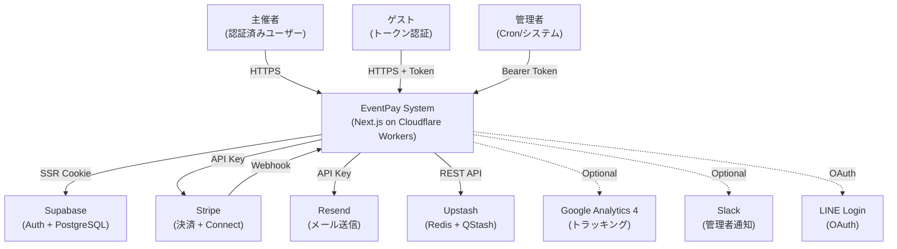
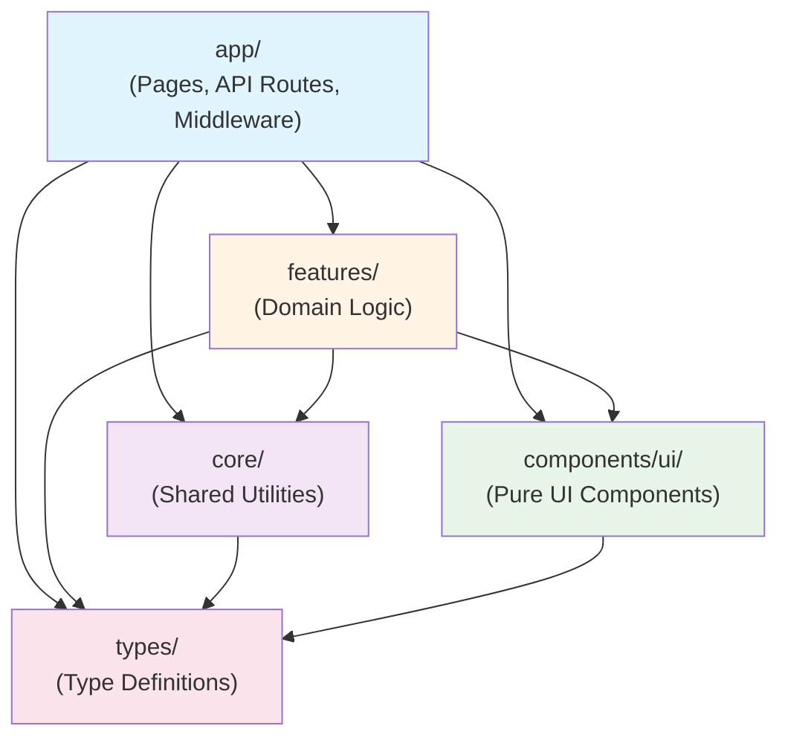
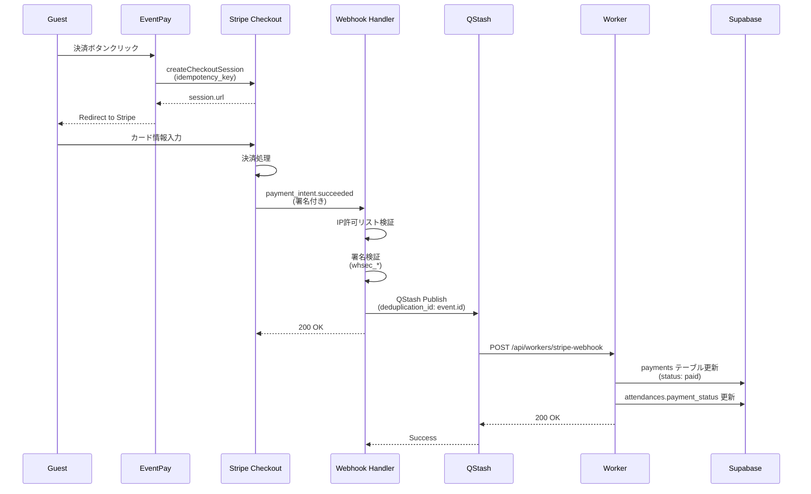

# アーキテクチャ

## 1. Scope / Non-goals

### この文書で分かること
- システム全体のコンポーネント構成と責務境界
- 主要な3つのユーザーフロー（招待→出欠、決済→入金反映、リマインダー）の動作シーケンス
- レイヤードアーキテクチャによる依存方向と変更影響範囲
- 認証・認可・決済Webhook検証などのセキュリティモデル

### この文書で分からないこと
- 各機能の詳細な実装ロジック
- データベーススキーマの詳細
- デプロイ手順・環境設定
- テスト戦略の詳細

## 2. System Overview

### ユーザー種別
- **主催者**: イベント作成・管理、決済状況確認、Stripe Connect口座連携
- **ゲスト（Guest）**: トークンベースで出欠回答・オンライン決済（アカウント不要）
- **システム**: 自動リマインダー送信、定期的なプラットフォーム残高監視

### 提供価値
- イベント出欠管理と集金を単一リンク共有で完結
- Stripe Connectによる主催者口座への直接振込（プラットフォーム手数料徴収なし）
- 現金・オンライン決済のハイブリッド対応

### 重要な品質特性
- **セキュリティ**: CSP nonce、RLS（Row Level Security）、Webhook署名検証、レート制限
- **冪等性**: Stripe決済リトライ時の重複防止（idempotency key使用）
- **可観測性**: 構造化ログ、セキュリティイベント専用ロガー

## 3. Context

### 外部アクター
- **主催者**: Supabase Auth（Google/LINE/Email）で認証、RLSで認可
- **ゲスト**: 招待トークン（UUID v4 + HMAC署名）で認証、トークン有効性検証で認可
- **Cron**: `CRON_SECRET` Bearer認証でリマインダー送信トリガー

### 外部サービス（信頼境界）
- **Supabase**: JWT検証、RLS適用、全テーブルへのアクセス制御
- **Stripe**: Webhook署名検証（`whsec_*` シークレット）、IP許可リスト
- **Upstash QStash**: 署名検証（`QSTASH_CURRENT_SIGNING_KEY`）、非同期Webhook処理
- **Resend**: API Key認証、送信元ドメイン検証

## 4. Containers

### Web Application（Next.js 14 App Router）
- **ホスティング**: Cloudflare Workers + OpenNext
- **責務**: SSR/SSG、Server Actions、API Routes、CSP nonce生成
- **特性**: エッジコンピューティング、R2インクリメンタルキャッシュ

### Database（Supabase PostgreSQL）
- **責務**: 永続化（events, attendances, payments, users）、RLS適用、監査ログ
- **接続**: `@supabase/ssr` でCookie同期、Service Role Keyで管理者操作

### Auth（Supabase Auth）
- **プロバイダー**: Google、LINE（OAuth 2.0）、Email/Password
- **トークン**: JWT（HTTPOnly Cookie）、セッション有効期限管理
- **ゲスト認証**: トークンベース（DB検証、有効期限チェック）

### Payment（Stripe）
- **Checkout Session**: 決済UI、成功時にWebhook通知
- **Connect Express**: 主催者口座への直接振込、onboarding flow
- **Webhook**: `payment_intent.succeeded`, `charge.refunded`, `account.updated` 等

### Mail（Resend）
- **テンプレート**: React Email（JSX）でHTML生成
- **送信トリガー**: リマインダーCron、参加・決済完了

### Queue（Upstash QStash）
- **責務**: Stripe Webhook処理の非同期化、リトライ・Deduplication
- **スキップ**: E2Eテスト時は同期処理モード（`SKIP_QSTASH_IN_TEST=true`）

### Rate Limiting（Upstash Redis）
- **適用箇所**: API Routes、Webhook受信、ゲストアクセス
- **手法**: HMAC fingerprinting + sliding window

## 5. Layering

### 依存方向（ESLint boundaries pluginで強制）
- **app**: 全層にアクセス可能（Pages, API Routes）
- **features**: `core`, `components/ui`, `types` のみ参照可
- **core**: 自身と `types` のみ参照可（features への依存禁止）
- **components/ui**: `types` のみ参照可（ビジネスロジック分離）

### 各層の責務
- **app**: ルーティング、認証ガード（middleware.ts）、CSP設定
- **features**: ドメイン機能（events, payments, guest, invite, settlements）、各機能は `index.ts` で公開API定義
- **core**: 認証、ロギング、セキュリティ、Stripe/Supabaseクライアント、バリデーション
- **components/ui**: shadcn/ui ベースの再利用可能コンポーネント

### Feature間の相互依存禁止
- 各feature内では相対パスで参照、他featureは参照不可
- 共有型は `@core/types` へ集約

## 6. Key Flows

### Flow 1: 招待リンク → ゲスト出欠回答

1. **主催者**: イベント作成 → 招待リンク生成
2. **システム**: トークン生成 → DB保存（`attendances` テーブル）
3. **ゲスト**: リンクアクセス → Middleware でトークン検証（有効期限・署名）
4. **ゲスト**: 出欠選択（attending/not_attending/maybe）→ Server Action実行
5. **システム**: `updateGuestAttendanceAction` → RLS無しでDB更新（トークン検証済み）
6. **システム**: 定員チェック（排他ロック `FOR UPDATE`）→ 超過時はエラー

### Flow 2: オンライン決済 → Webhook → 入金反映

1. **ゲスト**: 決済ボタンクリック → `createGuestStripeSessionAction` 実行
2. **システム**: Checkout Session作成（idempotency key: `{attendance_id}-{timestamp}`）
3. **Stripe**: 決済完了 → Webhook送信（`payment_intent.succeeded`）
4. **Webhook Handler**: IP検証 → 署名検証（Primary/Secondary secret）
5. **QStash**: 非同期処理（Deduplication ID = `event.id`）
6. **Worker**: `StripeWebhookEventHandler` → DB更新（`payments.status = 'paid'`）
7. **システム**: 冪等性保証（同一event.id の重複処理を防止）

### Flow 3: 現金集金の反映

1. **主催者**: ダッシュボードで参加者一覧表示 → 現金徴収行を選択
2. **主催者**: 「入金済みにする」ボタンクリック → Server Action実行
3. **システム**: `updatePaymentStatusAction` → 主催者権限検証（RLS: `created_by = auth.uid()`）
4. **システム**: `payments` テーブル更新（`status = 'received'`, `method = 'cash'`）
5. **システム**: 監査ログ記録（actor_type = 'user', category = 'payment'）
6. **システム**: UI即時反映（楽観的更新 or revalidatePath）

### Flow 4: リマインダー送信

1. **GitHub Actions**: 毎日 UTC 0:00（JST 9:00）に Cron実行 → `/api/cron/send-reminders` 呼び出し
2. **Cron Handler**: `CRON_SECRET` Bearer認証
3. **システム**: 管理者クライアント作成（RLS回避、監査ログ記録）
4. **ReminderService**: 対象イベント抽出（出欠期限24h前、決済期限24h前、開催24h前）
5. **EmailService**: Resend API経由でメール送信（React Emailテンプレート）
6. **システム**: 送信履歴をDB記録（重複送信防止）

## 7. Data & State

### 主要エンティティ
- **events**: 所有者（created_by）、定員（capacity）、期限（response_deadline, payment_deadline）
- **attendances**: ゲストトークン（guest_token, UNIQUE）、出欠状態（status: enum）
- **payments**: 決済状態（status: enum）、Stripe ID（stripe_payment_intent_id）、冪等キー
- **users**: Supabase Auth連携（id = auth.users.id）、削除フラグ（deleted_at）

### 状態遷移（payments.status）
- `pending` → `paid`（Stripe決済成功）
- `pending` → `failed`（決済失敗時）
- `pending` → `received`（現金入金）
- `paid` → `refunded`（Stripe返金）
- `pending` → `waived`（主催者が免除）
- `pending` → `canceled`（イベントキャンセル）

### Source of Truth
- **認証**: Supabase Auth（JWT Claims）
- **決済**: Stripe（Webhook event.id が一意識別子）
- **出欠**: attendances テーブル（ゲストトークンが一意キー）

### 冪等性の方針
- **Stripe API**: `idempotency_key` ヘッダー（24h有効）
- **Webhook処理**: QStash Deduplication（`event.id` ベース）
- **決済セッション作成**: `checkout_${uuid}` 形式のidempotency keyを生成

## 8. Security Model

### 認証・認可
- **主催者認証**: Supabase Auth（Google/LINE/Email）、JWT検証
- **ゲスト認証**: トークン検証（`validateGuestToken`）、形式検証（`gst_` + 32文字のBase64URL）・RLSベースの有効性チェック
- **Cron認証**: Bearer Token（`CRON_SECRET`、32文字以上）

### RLS（Row Level Security）方針
- **events**: `created_by = auth.uid()` で主催者のみ編集可
- **attendances**: ゲストトークン経由はRLS無効（Service Role使用）
- **payments**: 主催者 or 参加者本人のみ閲覧可
- **管理者操作**: `SecureSupabaseClientFactory` で監査ログ付きadmin client作成

### Webhook検証
- **Stripe署名**: Primary + Secondary secret対応（ローテーション対応）
- **タイムスタンプ許容**: 300秒（`STRIPE_WEBHOOK_TIMESTAMP_TOLERANCE`）
- **IP許可リスト**: 本番環境でStripe公式IPレンジのみ許可
- **QStash署名**: 現在 + 次世代キー対応（`QSTASH_CURRENT/NEXT_SIGNING_KEY`）

### レート制限・CSP
- **レート制限**: Upstash Redisベース、HMAC fingerprinting
- **CSP**: nonce + `strict-dynamic`、静的ページは `unsafe-inline`
- **セキュリティヘッダー**: `X-Frame-Options: DENY`, `frame-ancestors 'none'`

## 9. Observability & Ops

### ログ
- **構造化ログ**: JSON出力、Cloudflare Workers対応
- **セキュリティログ**: 専用ロガー（`security-logger.ts`）、監査ログテーブルへ記録
- **ログカテゴリ**: authentication, payment, webhook, security 等（enum定義）

### 失敗時のリカバリ
- **Webhook処理失敗**: QStashが自動リトライ（exponential backoff）
- **決済失敗**: Stripe Dashboard で手動再処理 or ユーザーが再試行
- **メール送信失敗**: リトライロジックなし（推測: Resend側で保証）

### 再実行・再送の扱い
- **冪等性キー**: Stripe API呼び出しで24h有効な `idempotency_key` 使用
- **Webhook重複防止**: QStash Deduplication（`event.id` ベース）
- **リマインダー重複防止**: DB記録で送信済みフラグ管理

### エラーハンドリング
- **Problem Details形式**: RFC 7807準拠のエラーレスポンス
- **Sentry**: Cloudflare Workers統合（`@sentry/cloudflare`）

## 変更時に更新すべき章のチェックリスト

| 変更内容 | 更新すべき章 |
|---------|------------|
| 新しい外部サービス統合（例: SMS送信） | 3. Context, 4. Containers |
| 新しいユーザーロールの追加 | 2. System Overview, 8. Security Model |
| features/ に新ドメイン追加 | 5. Layering |
| 決済フローの変更（例: 分割払い対応） | 6. Key Flows, 7. Data & State |
| 認証方式の変更（例: パスキー対応） | 8. Security Model, 3. Context |
| 新しい状態遷移の追加（payments.status） | 7. Data & State |
| 非同期処理基盤の変更（QStash → 別サービス） | 4. Containers, 6. Key Flows (Flow 2) |
| RLS ポリシーの変更 | 8. Security Model |
| ログ基盤の変更 | 9. Observability & Ops |
| アーキテクチャ上の重要な意思決定 | 10. ADR候補に追記 |
| レイヤー間の依存ルール変更 | 5. Layering, 10. ADR候補 |
| Webhook処理の冪等性戦略変更 | 7. Data & State, 9. Observability & Ops |
