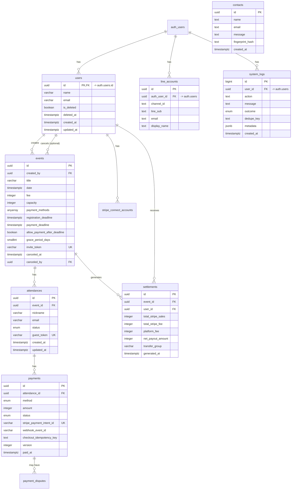

# データモデル

## 1. 目的とスコープ

本DBは本プロダクトの Single Source of Truth として、イベント運営・参加・決済・精算・監査ログに加え、問い合わせ（contacts）と外部認証連携（LINE）も管理します。
ブラウザから直接アクセスされ得る前提（Supabase）なので、exposed schema（public）ではRLSを有効化し、ポリシーを正として運用します。

## 2. ERD
主線は **users → events → attendances → payments** で、精算・dispute・監査・外部認証が周辺にぶら下がります。
下のERDは「関係（FK）」を正確に示し、列は読みやすさのため主要なものに絞ります。

## 3. 主要テーブル定義（要約）

### 3.1 users
- 役割：主催者（運営者）プロフィール。Supabase `auth.users` と連携する前提。
- PII候補：`email`

主な制約:
- `id` は `auth.users.id` と整合する（連携方法に依存）
- `LOWER(email)` のユニーク（NULL除外）等

### 3.2 events
- 役割：イベントのマスタ。招待リンクの “入口” も兼ねる。
- 主な列：`title`, `date`, `fee`, `capacity`, `payment_methods`, `registration_deadline`, `payment_deadline`, `invite_token`, `canceled_at`
- 主な制約:
  - `invite_token` は UNIQUE
  - `capacity` は NULL または > 0
  - Stripe等のオンライン決済を使う場合、`payment_deadline` を必須にする（CHECKなど）

### 3.3 attendances
- 役割：参加（RSVP）。イベント単位の参加者情報。
- 主な列：`nickname`, `email`, `status`, `guest_token`
- 主な制約:
  - `(event_id, LOWER(email))` を UNIQUE にして「同一イベントへの重複参加」を防ぐ
  - `guest_token` を UNIQUE
  - 定員制御（参加へ変更/追加時に capacity チェックするトリガー/関数など）

### 3.4 payments
- 役割：支払いの状態（Stripe/現金）を統一概念として保持。
- 主な列：`method`, `amount`, `status`, `stripe_payment_intent_id`, `webhook_event_id`, `checkout_idempotency_key`, `version`
- 主な制約:
  - `stripe_payment_intent_id` は UNIQUE（Stripe連携の重複防止）
  - `pending` のような “openな支払い” を attendance ごとに最大1つに制限（部分ユニーク）
  - `method` と `status` の整合（`paid` は Stripe、`received` は cash 等）

### 3.5 stripe_connect_accounts
- 役割：主催者の Stripe Connect 状態。
- 主な列：`stripe_account_id`, `status`, `charges_enabled`, `payouts_enabled`
- 制約：原則 1ユーザー 1アカウント

### 3.6 settlements
- 役割：イベント単位の精算レポート（スナップショット）。
- 主な列：`total_stripe_sales`, `platform_fee`, `net_payout_amount`, `transfer_group`, `generated_at`
- 制約：イベント×日付（JST等）で日次1件にするユニーク制約

### 3.7 payment_disputes
- 役割：Stripe dispute（チャージバック等）の記録。
- 主な列：`stripe_dispute_id`, `amount`, `status`
- 制約：`stripe_dispute_id` UNIQUE

### 3.8 system_logs
- 役割：監査ログ（操作やWebhook処理結果を追えるようにする）。
- 重要：重複防止キー（`dedupe_key`）を用意すると “冪等ログ” にできます。

### 3.9 fee_config
- 役割：手数料設定（シングルトン）。

## 4. RLS/認可方針（概要）

SupabaseはブラウザからDBへ直接アクセスし得るため、exposed schema（public）ではRLSを有効化し、ポリシーがない限りデータが見えない状態にする。

| テーブル | 主催者(authenticated) | ゲスト(anon) | service_role |
|---|---|---|---|
| users | 自分のみ参照/更新 | 原則なし | 全操作 |
| events | 自イベント参照/更新 | 招待トークン等で限定参照 | 全操作 |
| attendances | 自イベント参照/更新 | 自分の guest_token 分のみ参照/更新 | 全操作 |
| payments | 自イベント参照 | 自分の guest_token 分のみ参照 | 全操作（Webhook等） |
| settlements | 原則RPC経由 | なし | 全操作 |
| system_logs | なし | なし | 全操作 |

## 変更時に更新するチェックリスト

- [ ] テーブル/列/制約を変更したら ERD（2章）と主要テーブル要約（3章）を更新
- [ ] 支払いの状態を増減したら 5章（State）と 6章（冪等性キー）を更新
- [ ] RLS/ポリシーを変更したら 4章（認可要約表）を更新
