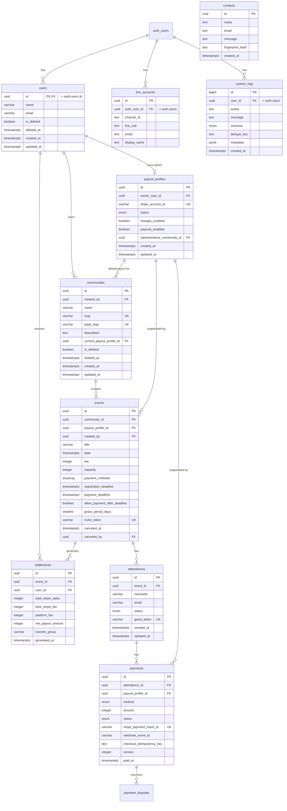

# データモデル

## 1. 目的とスコープ

本DBは本プロダクトの Single Source of Truth として、イベント運営・参加・決済・精算・監査ログに加え、問い合わせ（contacts）と外部認証連携（LINE）も管理します。
ブラウザから直接アクセスされ得る前提（Supabase）なので、exposed schema（public）ではRLSを有効化し、ポリシーを正として運用します。

community 機能導入後の主線は **users → communities → events → attendances → payments** です。現状、 `communities.created_by` が owner、`payout_profiles.owner_user_id UNIQUE` が 1 user = 1 payout profile を表します。

## 2. ERD

下のERDは「関係（FK）」を正確に示し、列は読みやすさのため主要なものに絞ります。

```mermaid
erDiagram
    auth_users ||--o{ users : "has"
    auth_users ||--o{ line_accounts : "has"
    auth_users ||--o{ system_logs : "has"

    users ||--o{ communities : "owns"
    users ||--o| payout_profiles : "owns (MVP)"
    users ||--o{ settlements : "receives"

    payout_profiles ||--o{ communities : "default payout for"
    communities ||--o{ events : "contains"
    payout_profiles ||--o{ events : "snapshotted by"
    events ||--o{ attendances : "has"
    attendances ||--o{ payments : "has"
    payout_profiles ||--o{ payments : "snapshotted by"

    payments ||--o{ payment_disputes : "may have"
    events ||--o{ settlements : "generates"

    users {
        uuid id PK ,FK "-> auth.users.id"
        varchar name
        varchar email
        boolean is_deleted
        timestamptz deleted_at
        timestamptz created_at
        timestamptz updated_at
    }

    communities {
        uuid id PK
        uuid created_by FK
        varchar name
        varchar slug UK
        varchar legal_slug UK
        text description
        uuid current_payout_profile_id FK
        boolean is_deleted
        timestamptz deleted_at
        timestamptz created_at
        timestamptz updated_at
    }

    payout_profiles {
        uuid id PK
        uuid owner_user_id FK
        varchar stripe_account_id UK
        enum status
        boolean charges_enabled
        boolean payouts_enabled
        uuid representative_community_id FK
        timestamptz created_at
        timestamptz updated_at
    }

    events {
        uuid id PK
        uuid community_id FK
        uuid payout_profile_id FK
        uuid created_by FK
        varchar title
        timestamptz date
        integer fee
        integer capacity
        anyarray payment_methods
        timestamptz registration_deadline
        timestamptz payment_deadline
        boolean allow_payment_after_deadline
        smallint grace_period_days
        varchar invite_token UK
        timestamptz canceled_at
        uuid canceled_by FK
    }

    attendances {
        uuid id PK
        uuid event_id FK
        varchar nickname
        varchar email
        enum status
        varchar guest_token UK
        timestamptz created_at
        timestamptz updated_at
    }

    payments {
        uuid id PK
        uuid attendance_id FK
        uuid payout_profile_id FK
        enum method
        integer amount
        enum status
        varchar stripe_payment_intent_id UK
        varchar webhook_event_id
        text checkout_idempotency_key
        integer version
        timestamptz paid_at
    }

    settlements {
        uuid id PK
        uuid event_id FK
        uuid user_id FK
        integer total_stripe_sales
        integer total_stripe_fee
        integer platform_fee
        integer net_payout_amount
        varchar transfer_group
        timestamptz generated_at
    }

    system_logs {
        bigint id PK
        uuid user_id FK "-> auth.users"
        text action
        text message
        enum outcome
        text dedupe_key
        jsonb metadata
        timestamptz created_at
    }

    contacts {
        uuid id PK
        text name
        text email
        text message
        text fingerprint_hash
        timestamptz created_at
    }

    line_accounts {
        uuid id PK
        uuid auth_user_id FK "-> auth.users"
        text channel_id
        text line_sub
        text email
        text display_name
    }
```

## 3. 主要テーブル定義（要約）

### 3.1 users
- 役割: 運営者プロフィール。Supabase `auth.users` と連携する前提。
- PII候補: `email`
- 主な制約:
  - `id` は `auth.users.id` と整合する
  - `LOWER(email)` のユニーク（NULL除外）等

### 3.2 communities
- 役割: イベントの所属先であり、公開ページと管理ワークスペースの単位。
- 主な列: `name`, `slug`, `legal_slug`, `description`, `current_payout_profile_id`, `is_deleted`
- 主な制約:
  - `slug` は `/c/{slug}` 用の一意値
  - `legal_slug` は `/tokushoho/{legal_slug}` 用の一意値
  - `created_by` は owner 固定
  - `current_payout_profile_id` は owner の payout profile のみを参照できる

### 3.3 payout_profiles
- 役割: 受取先の論理モデル。MVP では Stripe Connect account のラッパ。
- 主な列: `owner_user_id`, `stripe_account_id`, `status`, `charges_enabled`, `payouts_enabled`, `representative_community_id`
- 主な制約:
  - `owner_user_id UNIQUE` により MVP では 1 user = 1 payout profile
  - `representative_community_id` は owner 自身の未削除 community のみを参照できる
  - Connect onboarding で提出する `business_profile.url` は representative community の公開URLを使う

### 3.4 events
- 役割: イベントのマスタ。招待リンクの入口でもある。
- 主な列: `community_id`, `payout_profile_id`, `title`, `date`, `fee`, `payment_methods`, `registration_deadline`, `payment_deadline`, `invite_token`
- 主な制約:
  - `community_id` は NOT NULL
  - `invite_token` は UNIQUE
  - `payout_profile_id` はイベント作成時点の受取先 snapshot
  - Stripe 等のオンライン決済を使う場合、`payment_deadline` を必須にする
- 補足:
  - `created_by` は互換・監査用途として残るが、イベント所属と主要認可は `community_id` を正とする

### 3.5 attendances
- 役割: 参加（RSVP）。イベント単位の参加者情報。
- 主な列: `nickname`, `email`, `status`, `guest_token`
- 主な制約:
  - `(event_id, LOWER(email))` を UNIQUE にして同一イベントへの重複参加を防ぐ
  - `guest_token` を UNIQUE
  - 定員制御は DB 側の関数 / ロックで守る

### 3.6 payments
- 役割: 支払いの状態（Stripe / cash）を統一概念として保持。
- 主な列: `method`, `amount`, `status`, `payout_profile_id`, `stripe_payment_intent_id`, `checkout_idempotency_key`, `version`
- 主な制約:
  - `stripe_payment_intent_id` は UNIQUE
  - `pending` のような open な支払いを attendance ごとに最大1つへ制限する
  - `method` と `status` の整合を保つ
  - `method = 'stripe'` のとき `payout_profile_id` は必須
- 補足:
  - `payout_profile_id` は決済時点の受取先 snapshot。event 作成後に community のデフォルト受取先が変わっても過去決済は揺れない

### 3.7 settlements
- 役割: イベント単位の精算レポート（スナップショット）。
- 主な列: `total_stripe_sales`, `platform_fee`, `net_payout_amount`, `transfer_group`, `generated_at`

### 3.8 payment_disputes
- 役割: Stripe dispute（チャージバック等）の記録。
- 主な制約: `stripe_dispute_id` UNIQUE

### 3.9 system_logs
- 役割: 監査ログ。操作や Webhook 処理結果を追えるようにする。
- 重要: `dedupe_key` により冪等ログ化できる

### 3.10 fee_config
- 役割: 手数料設定（シングルトン）。

## 4. RLS / 認可方針（概要）

Supabase はブラウザから DB へ直接アクセスし得るため、exposed schema（public）では RLS を有効化し、ポリシーがない限りデータが見えない状態にする。

| テーブル | 主催者(authenticated) | ゲスト(anon) | service_role |
|---|---|---|---|
| users | 自分のみ参照 / 更新 | 原則なし | 全操作 |
| communities | owner の自 community のみ参照 / 更新 | なし | 全操作 |
| payout_profiles | owner の自分の行のみ参照 | なし | 全操作 |
| events | `event -> community owner` 基準で参照 / 更新 | 招待トークン等で限定参照 | 全操作 |
| attendances | `event -> community owner` 基準で参照 / 更新 | 自分の `guest_token` 分のみ参照 | 全操作 |
| payments | `event -> community owner` 基準で参照 / 更新 | 自分の `guest_token` 分のみ参照 | 全操作（Webhook等） |
| settlements | 原則RPC経由 | なし | 全操作 |
| system_logs | なし | なし | 全操作 |

## 5. 補足

- 現在選択中 community は `current_community_id` cookie で保持し、更新は Server Action 経由のみで行う
- cookie が無効な community を指す場合は、owner の最古の未削除 community へフォールバックする
- 削除済み community の公開ページ / 招待導線 / ゲスト参照は返さない

## 変更時に更新するチェックリスト

- [ ] テーブル / 列 / 制約を変更したら ERD（2章）と主要テーブル要約（3章）を更新
- [ ] payment / payout の責務を変更したら 3章と 4章を更新
- [ ] RLS / ポリシーを変更したら 4章を更新
- [ ] current community / representative community の仕様を変更したら 5章も更新
