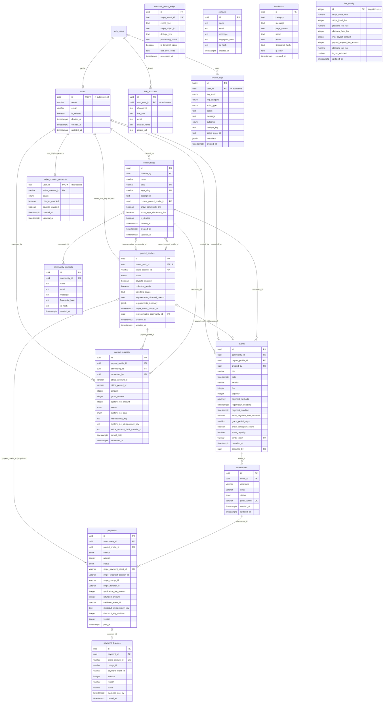

# データモデル

## 1. 目的とスコープ

本DBは本プロダクトの Single Source of Truth として、イベント運営・参加・決済・入金（payout）・監査ログに加え、問い合わせ / フィードバックと外部認証連携（LINE）も管理します。
スキーマ定義そのものの正は `supabase/migrations/*.sql` で、`local_schema.sql` と `types/database.ts` はそこから再生成されるスナップショットです（`pnpm run db:generate`）。
ブラウザから直接アクセスされ得る前提（Supabase）なので、exposed schema（public）ではRLSを有効化し、ポリシーを正として運用します。

community 機能導入後の主線は **users → communities → events → attendances → payments** です。現状、 `communities.created_by` が owner、`payout_profiles.owner_user_id UNIQUE` が 1 user = 1 payout profile を表します。

## 2. ERD

下のERDは `public` スキーマの全16テーブルと、全20本のFKを示します。列は読みやすさのため主要なものに絞ります。
このドキュメントは手書きであり、正は `supabase/migrations/*.sql` です（`local_schema.sql` は再生成されるスナップショット）。

```mermaid
erDiagram
    auth_users ||--o| users : "profile"
    auth_users ||--o{ line_accounts : "linked"
    auth_users o|--o{ system_logs : "actor"

    users ||--o{ communities : "created_by"
    users ||--o| payout_profiles : "owner_user_id (UNIQUE)"
    users ||--o{ events : "created_by"
    users o|--o{ events : "canceled_by"
    users ||--o{ payout_requests : "requested_by"
    users ||--o| stripe_connect_accounts : "user_id (deprecated)"

    payout_profiles o|--o{ communities : "current_payout_profile_id"
    payout_profiles o|--o{ events : "payout_profile_id (snapshot)"
    payout_profiles o|--o{ payments : "payout_profile_id (snapshot)"
    payout_profiles ||--o{ payout_requests : "payout_profile_id"

    communities o|--o| payout_profiles : "representative_community_id"
    communities ||--o{ events : "community_id"
    communities ||--o{ community_contacts : "community_id"
    communities ||--o{ payout_requests : "community_id"

    events ||--o{ attendances : "event_id"
    attendances ||--o{ payments : "attendance_id"
    payments o|--o{ payment_disputes : "payment_id"

    users {
        uuid id PK ,FK "-> auth.users.id"
        varchar name
        varchar email
        boolean is_deleted
        timestamptz deleted_at
        timestamptz created_at
        timestamptz updated_at
    }

    communities {
        uuid id PK
        uuid created_by FK
        varchar name
        varchar slug UK
        varchar legal_slug UK
        text description
        uuid current_payout_profile_id FK
        boolean show_community_link
        boolean show_legal_disclosure_link
        boolean is_deleted
        timestamptz deleted_at
        timestamptz created_at
        timestamptz updated_at
    }

    payout_profiles {
        uuid id PK
        uuid owner_user_id FK ,UK
        varchar stripe_account_id UK
        enum status
        boolean payouts_enabled
        boolean collection_ready
        text transfers_status
        text requirements_disabled_reason
        jsonb requirements_summary
        timestamptz stripe_status_synced_at
        uuid representative_community_id FK
        timestamptz created_at
        timestamptz updated_at
    }

    events {
        uuid id PK
        uuid community_id FK
        uuid payout_profile_id FK
        uuid created_by FK
        varchar title
        timestamptz date
        varchar location
        integer fee
        integer capacity
        anyarray payment_methods
        timestamptz registration_deadline
        timestamptz payment_deadline
        boolean allow_payment_after_deadline
        smallint grace_period_days
        boolean show_participant_count
        boolean show_capacity
        varchar invite_token UK
        timestamptz canceled_at
        uuid canceled_by FK
    }

    attendances {
        uuid id PK
        uuid event_id FK
        varchar nickname
        varchar email
        enum status
        varchar guest_token UK
        timestamptz created_at
        timestamptz updated_at
    }

    payments {
        uuid id PK
        uuid attendance_id FK
        uuid payout_profile_id FK
        enum method
        integer amount
        enum status
        varchar stripe_payment_intent_id UK
        varchar stripe_checkout_session_id
        varchar stripe_charge_id
        varchar stripe_transfer_id
        integer application_fee_amount
        integer refunded_amount
        varchar webhook_event_id
        text checkout_idempotency_key
        integer checkout_key_revision
        integer version
        timestamptz paid_at
    }

    payment_disputes {
        uuid id PK
        uuid payment_id FK
        varchar stripe_dispute_id UK
        varchar charge_id
        varchar payment_intent_id
        integer amount
        varchar reason
        varchar status
        timestamptz evidence_due_by
        timestamptz closed_at
    }

    payout_requests {
        uuid id PK
        uuid payout_profile_id FK
        uuid community_id FK
        uuid requested_by FK
        varchar stripe_account_id
        varchar stripe_payout_id
        integer amount
        integer gross_amount
        integer system_fee_amount
        enum status
        enum system_fee_state
        text idempotency_key
        text system_fee_idempotency_key
        text stripe_account_debit_transfer_id
        timestamptz arrival_date
        timestamptz requested_at
    }

    stripe_connect_accounts {
        uuid user_id PK ,FK "deprecated"
        varchar stripe_account_id UK
        enum status
        boolean charges_enabled
        boolean payouts_enabled
        timestamptz created_at
        timestamptz updated_at
    }

    community_contacts {
        uuid id PK
        uuid community_id FK
        text name
        text email
        text message
        text fingerprint_hash
        text ip_hash
        timestamptz created_at
    }

    system_logs {
        bigint id PK
        uuid user_id FK "-> auth.users"
        enum log_level
        enum log_category
        enum actor_type
        text action
        text message
        enum outcome
        text dedupe_key
        text stripe_event_id
        jsonb metadata
        timestamptz created_at
    }

    webhook_event_ledger {
        uuid id PK
        text stripe_event_id UK
        text event_type
        text stripe_object_id
        text dedupe_key
        text processing_status
        boolean is_terminal_failure
        text last_error_code
        timestamptz processed_at
    }

    contacts {
        uuid id PK
        text name
        text email
        text message
        text fingerprint_hash
        text ip_hash
        timestamptz created_at
    }

    feedbacks {
        uuid id PK
        text category
        text message
        text page_context
        text name
        text email
        text fingerprint_hash
        text ip_hash
        timestamptz created_at
    }

    fee_config {
        integer id PK "singleton (=1)"
        numeric stripe_base_rate
        integer stripe_fixed_fee
        numeric platform_fee_rate
        integer platform_fixed_fee
        integer min_payout_amount
        integer payout_request_fee_amount
        numeric platform_tax_rate
        boolean is_tax_included
        timestamptz updated_at
    }

    line_accounts {
        uuid id PK
        uuid auth_user_id FK "-> auth.users"
        text channel_id
        text line_sub
        text email
        text display_name
        text picture_url
    }
```

FKを持たない独立テーブルは `contacts` / `feedbacks` / `fee_config` / `webhook_event_ledger` の4つです。

## 3. 主要テーブル定義（要約）

### 3.1 users
- 役割: 運営者プロフィール。Supabase `auth.users` と連携する前提。
- PII候補: `email`
- 主な制約:
  - `id` は `auth.users.id` と整合する
  - `LOWER(email)` のユニーク（NULL除外）等

### 3.2 communities
- 役割: イベントの所属先であり、公開ページと管理ワークスペースの単位。
- 主な列: `name`, `slug`, `legal_slug`, `description`, `current_payout_profile_id`, `is_deleted`
- 主な制約:
  - `slug` は `/c/{slug}` 用の一意値
  - `legal_slug` は `/tokushoho/{legal_slug}` 用の一意値
  - `created_by` は owner 固定
  - `current_payout_profile_id` は owner の payout profile のみを参照できる

### 3.3 payout_profiles
- 役割: 受取先の論理モデル。MVP では Stripe Connect account のラッパ。
- 主な列: `owner_user_id`, `stripe_account_id`, `status`, `payouts_enabled`, `representative_community_id`
- 主な制約:
  - `owner_user_id UNIQUE` により MVP では 1 user = 1 payout profile
  - `representative_community_id` は owner 自身の未削除 community のみを参照できる
  - Connect onboarding で提出する `business_profile.url` は representative community の公開URLを使う

### 3.4 events
- 役割: イベントのマスタ。招待リンクの入口でもある。
- 主な列: `community_id`, `payout_profile_id`, `title`, `date`, `fee`, `payment_methods`, `registration_deadline`, `payment_deadline`, `invite_token`
- 主な制約:
  - `community_id` は NOT NULL
  - `invite_token` は UNIQUE
  - `payout_profile_id` はイベント作成時点の受取先 snapshot
  - Stripe 等のオンライン決済を使う場合、`payment_deadline` を必須にする
- 補足:
  - `created_by` は互換・監査用途として残るが、イベント所属と主要認可は `community_id` を正とする

### 3.5 attendances
- 役割: 参加（RSVP）。イベント単位の参加者情報。
- 主な列: `nickname`, `email`, `status`, `guest_token`
- 主な制約:
  - `(event_id, LOWER(email))` を UNIQUE にして同一イベントへの重複参加を防ぐ
  - `guest_token` を UNIQUE
  - 定員制御は DB 側の関数 / ロックで守る

### 3.6 payments
- 役割: 支払いの状態（Stripe / cash）を統一概念として保持。
- 主な列: `method`, `amount`, `status`, `payout_profile_id`, `stripe_payment_intent_id`, `checkout_idempotency_key`, `version`
- 主な制約:
  - `stripe_payment_intent_id` は UNIQUE
  - `pending` のような open な支払いを attendance ごとに最大1つへ制限する
  - `method` と `status` の整合を保つ
  - `status` の遷移は `can_promote_payment_status()` の遷移表にトリガーが従わせる。現金の集金取り消し（`received` / `waived` → `pending`）のみ内部RPCがバイパスする
  - `method = 'stripe'` のとき `payout_profile_id` は必須
  - `amount` は正（0円決済は作らない）。`refunded_amount` などの他の金額列は非負
  - `version` は UPDATE のたびにトリガーが必ず +1 する（巻き戻し不可）
- 補足:
  - `payout_profile_id` は決済時点の受取先 snapshot。event 作成後に community のデフォルト受取先が変わっても過去決済は揺れない

### 3.7 payment_disputes
- 役割: Stripe dispute（チャージバック等）の記録。
- 主な列: `payment_id`, `stripe_dispute_id`, `charge_id`, `amount`, `reason`, `status`, `evidence_due_by`
- 主な制約: `stripe_dispute_id` UNIQUE

### 3.8 payout_requests
- 役割: アプリ内から実行した Stripe connected account への入金リクエスト履歴。
- 主な列: `payout_profile_id`, `community_id`, `requested_by`, `amount`, `gross_amount`, `system_fee_amount`, `status`, `system_fee_state`, `idempotency_key`
- 主な制約:
  - `gross_amount = amount + system_fee_amount`（振込可能残高＝入金額＋システム手数料）
  - `amount > 0`、`gross_amount >= 0`、`system_fee_amount >= 0`
  - `currency` は `'jpy'` 固定
- 補足:
  - 金額はすべて円（JPY最小通貨単位）
  - payout の前に Account Debit でシステム手数料を回収する。その状態を `system_fee_state` と `stripe_account_debit_*` 列で追跡する
  - `idempotency_key` / `system_fee_idempotency_key` はそれぞれ Stripe payout 作成時・Account Debit 作成時の Idempotency-Key

### 3.9 system_logs
- 役割: 監査ログ。操作や Webhook 処理結果を追えるようにする。
- 主な列: `log_level`, `log_category`, `actor_type`, `action`, `outcome`, `resource_type`, `resource_id`, `metadata`
- 重要: `dedupe_key` により冪等ログ化できる
- 補足: `user_id` は `public.users` ではなく `auth.users` を参照する

### 3.10 webhook_event_ledger
- 役割: Stripe Webhook を `event.id` 単位で冪等化するための ledger。
- 主な列: `stripe_event_id`, `event_type`, `dedupe_key`, `processing_status`, `is_terminal_failure`
- 主な制約:
  - `stripe_event_id` は UNIQUE（一次重複判定キー）
  - `processing_status` は `processing` / `succeeded` / `failed` のいずれか
- 補足: `dedupe_key` は `event.type + data.object.id` の観測用キーで、一次キーとは別軸

### 3.11 fee_config
- 役割: 手数料設定（シングルトン、`id = 1`）。
- 主な列: `stripe_base_rate`, `platform_fee_rate`, `min_payout_amount`, `payout_request_fee_amount`, `platform_tax_rate`, `is_tax_included`
- 主な制約: `min_payout_amount > 0`、`payout_request_fee_amount >= 0`
- 補足: `is_tax_included` が内税（true）/ 外税（false）の切り替え

### 3.12 contacts / community_contacts / feedbacks
公開ページからの入力を受け取る3テーブル。いずれも `fingerprint_hash` / `ip_hash` / `user_agent` を保持し、投稿は可能だが読み出しは制限される。

- `contacts`: プラットフォーム運営への問い合わせ。FKなし
- `community_contacts`: コミュニティ公開ページから主催者へ届く問い合わせ。`community_id` FK を持ち、公開コミュニティ宛てのみ挿入できる
- `feedbacks`: プロダクトへのフィードバック。`category` は `feature_request` / `bug_report` / `usability` / `other`。FKなし

### 3.13 line_accounts
- 役割: LINE ログインの外部ID連携。
- 主な列: `auth_user_id`, `channel_id`, `line_sub`, `display_name`, `picture_url`
- 補足: `auth_user_id` は `auth.users` を参照する

### 3.14 stripe_connect_accounts（非推奨）
- 状態: **非推奨。`payout_profiles` へ移行済みの旧テーブル。**
- 現況:
  - アプリコード（`app/` / `core/` / `features/`）からの参照は0件
  - `payout_profiles` のテーブルコメントが「既存stripe_connect_accountsの移行先」と明記している
  - 一方で anon 向けの SELECT ポリシー（`Guests can view event organizer stripe accounts`）を含む RLS ポリシーが残存している
- 新規実装でこのテーブルを参照してはいけない。受取先の状態は `payout_profiles` を正とする。削除の可否は [#574](https://github.com/rytkhs/event-pay/issues/574) で検討する

## 4. RLS / 認可方針（概要）

Supabase はブラウザから DB へ直接アクセスし得るため、exposed schema（public）では RLS を有効化し、ポリシーがない限りデータが見えない状態にする。
`public` の全16テーブルで RLS が有効。`contacts` / `feedbacks` / `line_accounts` を除く13テーブルは FORCE ROW LEVEL SECURITY も設定されている。

| テーブル | 主催者(authenticated) | ゲスト(anon) | service_role |
|---|---|---|---|
| users | 自分のみ参照 / 更新 | 原則なし | 全操作 |
| communities | owner の自 community のみ参照 / 更新 | なし | 全操作 |
| payout_profiles | owner の自分の行のみ参照 | なし | 全操作 |
| events | `event -> community owner` 基準で参照 / 更新 | 招待トークン等で限定参照 | 全操作 |
| attendances | `event -> community owner` 基準で参照 / 更新 | 自分の `guest_token` 分のみ参照 | 全操作 |
| payments | `event -> community owner` 基準で参照 / 更新 | 自分の `guest_token` 分のみ参照 | 全操作（Webhook等） |
| payment_disputes | `payment -> event owner` 基準で参照 | なし | 全操作 |
| payout_requests | owner の自分の行のみ参照 | なし | 全操作 |
| community_contacts | owner の自 community 分のみ参照 | 公開 community 宛てに挿入のみ | 全操作 |
| contacts | 挿入のみ（参照は常に不可） | 挿入のみ（参照は常に不可） | 全操作 |
| feedbacks | 挿入のみ（参照は常に不可） | 挿入のみ（参照は常に不可） | 全操作 |
| fee_config | 参照のみ | なし | 全操作 |
| webhook_event_ledger | なし | なし | 全操作 |
| system_logs | なし | なし | 全操作 |
| line_accounts | なし（ポリシー未定義） | なし | 全操作（RLSバイパス） |
| stripe_connect_accounts（非推奨） | 自分の行を全操作 | イベント主催者の行を参照 | 全操作 |

## 5. 補足

- 現在選択中 community は `current_community_id` cookie で保持し、更新は Server Action 経由のみで行う
- cookie が無効な community を指す場合は、owner の最古の未削除 community へフォールバックする
- 削除済み community の公開ページ / 招待導線 / ゲスト参照は返さない

## 変更時に更新するチェックリスト

- [ ] テーブル / 列 / 制約を変更したら ERD（2章）と主要テーブル要約（3章）を更新
- [ ] テーブルを追加 / 削除したら ERD が全テーブル・全FKを網羅しているか確認（`local_schema.sql` と突き合わせる）
- [ ] payment / payout の責務を変更したら 3章と 4章を更新
- [ ] RLS / ポリシーを変更したら 4章を更新
- [ ] current community / representative community の仕様を変更したら 5章も更新
