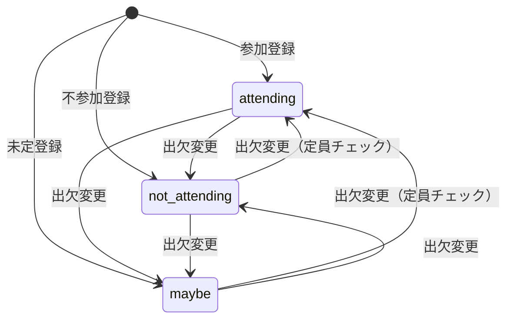
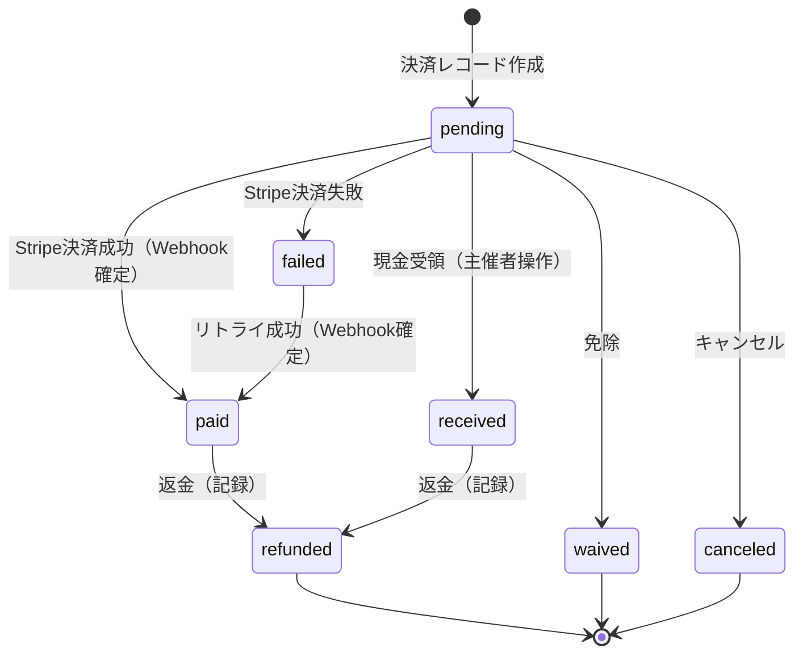
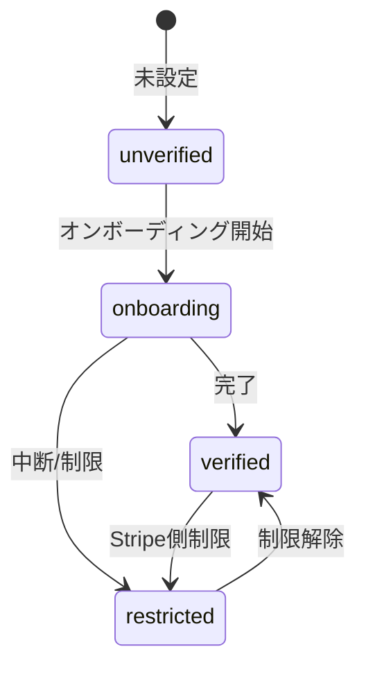

# ドメインモデル

## 1. 目的とスコープ

### 目的
- クローズドコミュニティ向けのイベント出欠管理・集金ツールとして、参加確認から集金までを“リンク共有だけで完結”させる。

### スコープ（含む）
- イベント作成・編集、招待リンク管理
- 出欠登録（ゲストトークンによる匿名参加を含む）
- 定員管理
- 現金/Stripe決済
- Stripe Connect連携（主催者の受け取り設定）
- 精算レポート（売上/手数料/控除の集計スナップショット）
- メール通知/リマインダー

### スコープ外（明示）
- 継続課金
- 複数イベント横断の高度な会計（会計年度・部門別など）
- 返金の“自動実行”（記録は対応、実行はStripe側手動）

## 2. 用語集（ユビキタス言語）

### 2.1 推奨表記 / 禁止表記

| 推奨表記（原則） | 例（コード/DB） | 禁止表記（混在防止） | 定義 |
|---|---|---|---|
| Event | `events` | - | 開催イベント。参加条件・期限・参加費などを持つ。 |
| Attendance | `attendances` | RSVP, Registration（乱用） | 参加者の出欠（attending/not_attending/maybe）と、ゲスト識別情報を持つ。 |
| Guest | `guest_token` | visitor, anonymous participant | アカウント不要で参加する匿名参加者（ゲストトークンで識別）。 |
| Creator（≒主催者） | `events.created_by` | organizer, host（混在） | イベント作成者。主催者としてイベントを管理できる。 |
| Payment | `payments` | transaction, billing | 支払いの単位（オンライン/現金を統一して扱う）。 |
| Settlement | `settlements` | payout, transfer | 精算レポート（集計スナップショット）。実送金そのものとは区別する。 |
| invite_token | `events.invite_token` | invitation code（混在） | 招待リンクで使うトークン。 |
| guest_token | `attendances.guest_token` | guestKey（混在） | 匿名参加者の本人性を担保するトークン。 |

### 2.2 Enum（列挙型）定義
- `attendance_status_enum`: `attending` / `not_attending` / `maybe`
- `payment_method_enum`: `stripe` / `cash`
- `payment_status_enum`: `pending` / `paid` / `failed` / `received` / `refunded` / `waived` / `canceled`
- `stripe_account_status_enum`: `unverified` / `onboarding` / `verified` / `restricted`
- `actor_type_enum`: `user` / `guest` / `system` / `webhook` / `service_role` / `anonymous`

## 3. ドメイン境界（Bounded Context）

- イベント管理コンテキスト（Event）
  - イベント作成・編集・キャンセル、期限や参加条件の定義
- 出欠管理コンテキスト（Attendance / Guest）
  - ゲストトークンによる匿名参加、出欠ステータス変更、定員チェック
- 決済コンテキスト（Payment）
  - Stripe/現金の支払い状態、冪等性、Webhook確定処理
- 精算コンテキスト（Settlement）
  - 売上/手数料/控除/純額の集計、レポート生成
- 認証・権限コンテキスト（Auth / RLS）
  - user/guest/service_role の権限境界

## 4. 集約（Aggregate）と一貫性境界

### 4.1 Event集約
- **集約ルート**: Event
- **含まれる概念（関連）**: Attendance / Payment / Settlement は Event に紐づくが、更新単位や整合性は個別ルールで守る。
- **Event側で守りたい不変条件（例）**
  - 締切や定員など、“イベント条件”の整合性
  - 参加者/決済が発生した後の編集制限（構造的制限）

### 4.2 Attendance集約
- **集約ルート**: Attendance
- **守ること**
  - guest_token をキーに「本人のAttendanceだけ更新できる」こと
  - 出欠変更のルール（締切、定員、決済要否）

### 4.3 Payment集約
- **集約ルート**: Payment
- **守ること**
  - ステータス整合性（paidはStripeのみ、receivedは現金のみ等）
  - 冪等性（Checkout Session作成、Webhook重複）
  - ロールバック禁止（必要なら status_rank などで保証）

## 5. 主要エンティティ（責務・属性・不変条件）

### 5.1 Event（events）
- 責務: イベント情報の管理、参加条件・期限の定義
- 主な属性（カテゴリ）
  - 基本: title, date, location, description
  - 料金/支払い: fee, payment_methods
  - 制限: capacity, registration_deadline, payment_deadline, grace_period_days
  - 状態: canceled_at, canceled_by
- 不変条件（例）
  - registration_deadline ≤ date
  - Stripe決済を含む場合、payment_deadline 必須

### 5.2 Attendance（attendances）
- 責務: 出欠記録、ゲスト本人性（guest_token）を含む参加者情報の保持
- 主な属性（カテゴリ）
  - 参加者: nickname, email
  - 出欠: status
  - 本人性: guest_token
- 不変条件（例）
  - nickname は空でない
  - email は妥当な形式
  - guest_token は `gst_` プレフィックス + 32文字

### 5.3 Payment（payments）
- 責務: 支払いの単位。オンライン/現金を統一して管理し、最終状態を保持する
- 主な属性（カテゴリ）
  - 金額/方法: method, amount
  - 状態: status, paid_at
  - Stripe連携: stripe_payment_intent_id, stripe_checkout_session_id, application_fee_amount 等
  - 返金: refunded_amount, application_fee_refunded_amount
  - 競合制御: version（楽観ロック）
  - 冪等性: checkout_idempotency_key, checkout_key_revision 等
- 不変条件（例）
  - `paid` は Stripe のみ、`received` は現金のみ
  - Stripe決済で非pending/canceledのとき、payment_intent_id 等が必須

### 5.4 Settlement（settlements）
- 責務: イベント単位の集計スナップショット（売上/手数料/控除/純額）
- 主な属性（カテゴリ）
  - total_stripe_sales, total_stripe_fee, platform_fee, net_payout_amount 等
- 注意
  - Settlementは「支払いや送金の実行」ではなく、「集計レポート」であることを明示する

### 5.5 StripeConnectAccount（stripe_connect_accounts）
- 責務: 主催者のStripe Connectアカウント状態を管理し、決済可否判断に使う
- 主な属性: stripe_account_id, status, charges_enabled, payouts_enabled
- 不変条件: user_id はユニーク（1ユーザー1アカウント）

## 6. 状態遷移（State Machines）

### 6.1 Attendance Status

### 6.2 Payment Status

### 6.3 Stripe Connect Account Status

---

## 7. ビジネスルール（Invariants）

### 7.1 定員
- `attending` への遷移時のみ定員チェック対象（not_attending/maybeは対象外）
- 同時更新を考慮し、DB側で排他制御（例: `FOR UPDATE`）を行う

### 7.2 締切
- 登録締切はイベント日時以前
- 支払締切は登録締切以降、かつイベント日時（または+猶予）まで
- 猶予期間（grace_period_days）がある場合、支払い許可の範囲を明示する

### 7.3 編集制限（Restriction）
- 参加者がいる場合、参加費・決済方法・定員などは制限される
- Stripe決済済みが存在する場合、参加費変更は原則不可（構造的制限）
- フェイルクローズ方針（判定失敗時は“編集不可”側へ倒す）を採用する箇所があるなら明示する

### 7.4 冪等性（Idempotency）
- Checkout Session 作成は冪等キーで二重作成を防ぐ
- Webhook処理はイベントID等で重複処理を防ぐ
- Payment更新は楽観ロック（version）やロールバック禁止で整合性を守る

## 8. 権限モデル（Who can do what）

### アクター
- user: 認証済みユーザー（主催者）
- guest: ゲストトークン保持者（匿名参加）
- anonymous: トークンなし匿名（招待リンク閲覧のみ等、可能な範囲）
- service_role/system/webhook: システム処理（バックグラウンド/確定処理）

### 権限の原則
- 主催者は「自分のイベント」に対して操作可能
- ゲストは「自分のguest_tokenに紐づくAttendance/Payment」に限定して操作可能
- 重要な更新は DB（RLS + SECURITY DEFINER関数等）でも守る

## 9. 外部サービス境界（腐敗防止層）

- Stripe（Payment/Connect）は外部の概念が強いため、ドメインを汚染しないように翻訳層（ACL）を設ける
  - 例: “Stripeのイベント名/状態” → “PaymentStatus” へ変換する責務を境界に閉じ込める

## 10. 例外・エッジケース（抜粋）

- 定員ギリギリの同時参加登録（排他制御で先着順）
- 決済ボタン連打によるCheckout Session重複（冪等性で防ぐ）
- Webhook重複配信（重複排除）
- Webhook到着と現金受領の競合（楽観ロック/優先順位で決める）
- Connect未設定での決済試行（事前にUI/サーバで弾く or 明確なエラー）

## ドメイン変更時に更新すべき箇所

- [ ] 用語集（推奨/禁止表記、Enum）
- [ ] 状態遷移図（Attendance/Payment/Connect）
- [ ] 不変条件（締切/定員/編集制限/冪等性）
- [ ] 権限モデル（user/guest/service_role）
- [ ] 関連するflowsとADR
