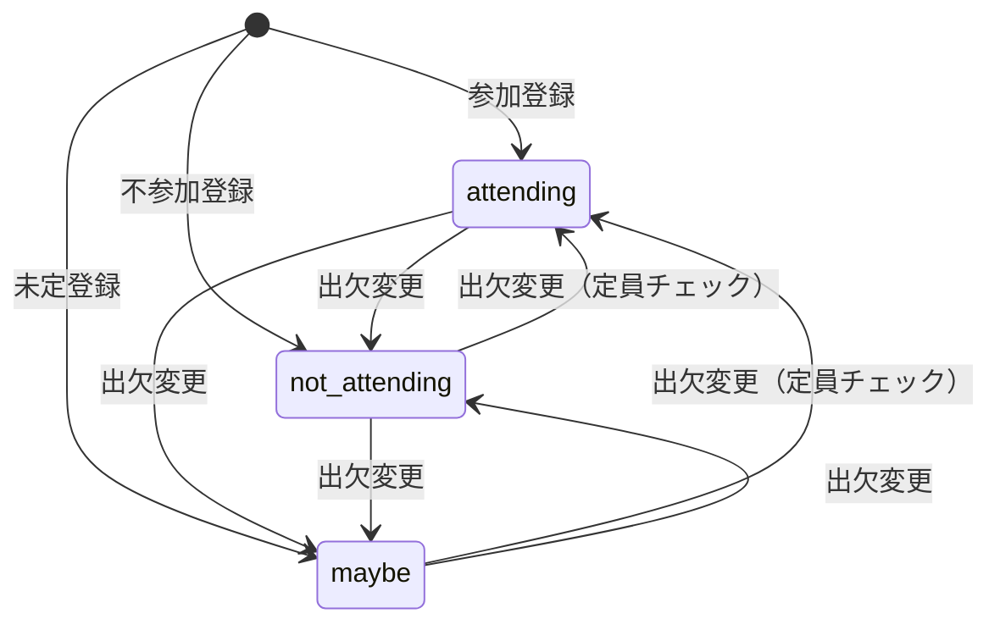
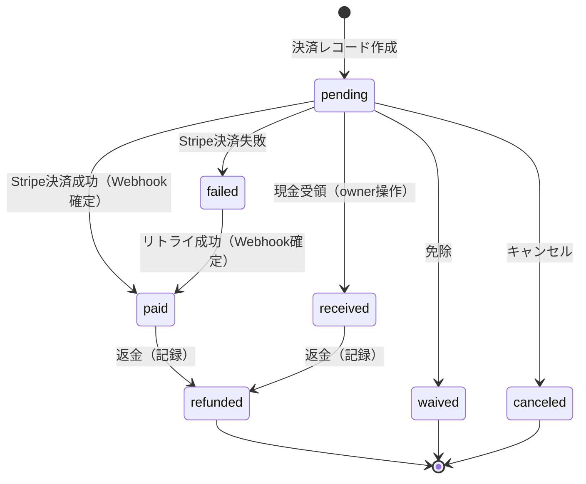
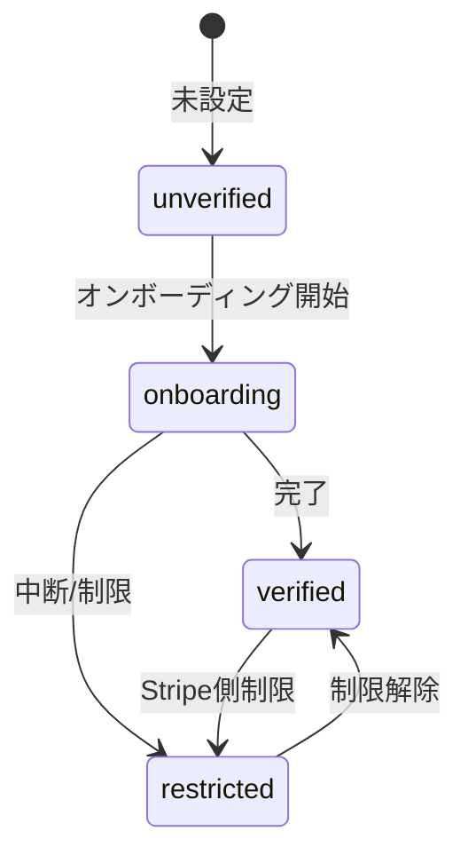

# ドメインモデル

## 1. 目的とスコープ

### 目的
- クローズドコミュニティ向けのイベント出欠管理・集金ツールとして、参加確認から集金までをリンク共有だけで完結させる。
- community を運営単位、payout profile を受取先単位として扱い、公開ページと決済責務を分離する。

### スコープ（含む）
- community 作成・切り替え・公開ページ管理
- イベント作成・編集、招待リンク管理
- 出欠登録（ゲストトークンによる匿名参加を含む）
- 定員管理
- 現金 / Stripe 決済
- Stripe Connect 連携（community owner の受取設定）
- 精算レポート（売上 / 手数料 / 控除の集計スナップショット）
- メール通知 / リマインダー

### スコープ外（明示）
- 継続課金
- 複数イベント横断の高度な会計（会計年度・部門別など）
- 返金の自動実行（記録は対応、実行はStripe側手動）
- 共同管理者や owner 移譲

## 2. 用語集（ユビキタス言語）

### 2.1 推奨表記 / 禁止表記

| 推奨表記（原則） | 例（コード/DB） | 定義 |
|---|---|---|
| Community | `communities` | イベントを束ねる運営単位。公開ページと設定画面を持つ。 |
| Current Community | `current_community_id` cookie | 管理画面で現在選択中の community。 |
| Public Page | `/c/{slug}` | community の公開URL。Stripe 提出URLや説明導線に使う。 |
| Legal Page | `/tokushoho/{legal_slug}` | community 基準の特商法ページ。 |
| Payout Profile | `payout_profiles` | 受取先の論理モデル。MVP では Stripe Connect account のラッパ。 |
| Representative Community | `representative_community_id` | Stripe `business_profile.url` に使う代表 community。 |
| Event | `events` | community に属する開催イベント。 |
| Attendance | `attendances` | 参加者の出欠とゲスト識別情報を持つ。 |
| Guest | `guest_token` | アカウント不要で参加する匿名参加者。 |
| Payment | `payments` | 支払いの単位。オンライン / 現金を統一して扱う。 |
| Settlement | `settlements` | 精算レポート。実送金そのものとは区別する。 |
| invite_token | `events.invite_token` | 招待リンクで使うトークン。 |
| guest_token | `attendances.guest_token` | 匿名参加者の本人性を担保するトークン。 |

### 2.2 Enum（列挙型）定義
- `attendance_status_enum`: `attending` / `not_attending` / `maybe`
- `payment_method_enum`: `stripe` / `cash`
- `payment_status_enum`: `pending` / `paid` / `failed` / `received` / `refunded` / `waived` / `canceled`
- `stripe_account_status_enum`: `unverified` / `onboarding` / `verified` / `restricted`
- `actor_type_enum`: `user` / `guest` / `system` / `webhook` / `service_role` / `anonymous`

## 3. ドメイン境界（Bounded Context）

- コミュニティ運営コンテキスト（Community / Workspace）
  - current community の切り替え、community 設定、削除、公開導線
- 公開 community コンテキスト（Public Community）
  - `/c/{slug}`、`/tokushoho/{legal_slug}`、community 問い合わせ
- イベント管理コンテキスト（Event）
  - current community 配下でのイベント作成・編集・キャンセル、期限や参加条件の定義
- 出欠管理コンテキスト（Attendance / Guest）
  - ゲストトークンによる匿名参加、出欠ステータス変更、定員チェック
- 決済コンテキスト（Payment）
  - Stripe / cash の支払い状態、冪等性、Webhook 確定処理、payout snapshot
- 受取設定コンテキスト（Payout / Connect）
  - payout profile、representative community、Connect onboarding
- 精算コンテキスト（Settlement）
  - 売上 / 手数料 / 控除 / 純額の集計。CC-10 方針どおり今回の主更新対象外
- 認証・権限コンテキスト（Auth / RLS）
  - user / guest / service_role の権限境界

## 4. 集約（Aggregate）と一貫性境界

### 4.1 Community集約
- **集約ルート**: Community
- **守ること**
  - owner 固定
  - current payout profile は owner の payout profile だけを参照できる
  - 削除済み community は公開導線から外れる

### 4.2 Event集約
- **集約ルート**: Event
- **守ること**
  - event は必ず community に属する
  - event 作成時に payout profile snapshot を固定する
  - 締切や定員などイベント条件の整合性
  - 参加者 / 決済が発生した後の編集制限

### 4.3 Attendance集約
- **集約ルート**: Attendance
- **守ること**
  - `guest_token` をキーに本人の Attendance だけ更新できること
  - 出欠変更のルール（締切、定員、決済要否）

### 4.4 Payment集約
- **集約ルート**: Payment
- **守ること**
  - ステータス整合性（`paid` は Stripe のみ、`received` は cash のみ）
  - `payments.payout_profile_id` により決済時点の受取先が固定されること
  - 冪等性（Checkout Session 作成、Webhook 重複）
  - ロールバック禁止

## 5. 主要エンティティ（責務・属性・不変条件）

### 5.1 Community（communities）
- 責務: 運営単位の管理、公開ページ情報の保持、日常操作の文脈提供
- 主な属性
  - 基本: `name`, `description`
  - 公開: `slug`, `legal_slug`
  - 受取設定: `current_payout_profile_id`
  - 状態: `is_deleted`, `deleted_at`
- 不変条件
  - owner は作成者固定
  - `slug` と `legal_slug` は一意
  - `current_payout_profile_id` は owner の payout profile に限る

### 5.2 Payout Profile（payout_profiles）
- 責務: 受取先情報と Stripe Connect 状態の保持
- 主な属性
  - 所有: `owner_user_id`
  - Connect: `stripe_account_id`, `status`, `charges_enabled`, `payouts_enabled`
  - 提出URL: `representative_community_id`
- 不変条件
  - MVP では 1 user = 1 payout profile
  - representative community は owner 自身の未削除 community に限る

### 5.3 Event（events）
- 責務: イベント情報の管理、参加条件・期限の定義
- 主な属性
  - 所属: `community_id`
  - 受取: `payout_profile_id`
  - 基本: `title`, `date`, `location`, `description`
  - 料金 / 支払い: `fee`, `payment_methods`
  - 制限: `capacity`, `registration_deadline`, `payment_deadline`, `grace_period_days`
  - 状態: `canceled_at`, `canceled_by`
- 不変条件
  - `community_id` は必須
  - `registration_deadline <= date`
  - Stripe 決済を含む場合、`payment_deadline` 必須
  - 有料かつ Stripe を含む場合、作成時の current community payout readiness が必要
- 補足
  - `created_by` は互換 / 監査用補助情報として残るが、主要な所属・認可・公開導線は `community_id` を正とする

### 5.4 Attendance（attendances）
- 責務: 出欠記録、ゲスト本人性（`guest_token`）を含む参加者情報の保持
- 主な属性
  - 参加者: `nickname`, `email`
  - 出欠: `status`
  - 本人性: `guest_token`
- 不変条件
  - `nickname` は空でない
  - `email` は妥当な形式
  - `guest_token` は推測困難

### 5.5 Payment（payments）
- 責務: 支払いの単位。オンライン / 現金を統一して管理し、最終状態を保持する
- 主な属性
  - 金額 / 方法: `method`, `amount`
  - 状態: `status`, `paid_at`
  - 受取 snapshot: `payout_profile_id`
  - Stripe連携: `stripe_payment_intent_id`, `stripe_checkout_session_id`, `application_fee_amount`
  - 返金: `refunded_amount`, `application_fee_refunded_amount`
  - 競合制御: `version`
  - 冪等性: `checkout_idempotency_key`, `checkout_key_revision`
- 不変条件
  - `paid` は Stripe のみ、`received` は現金のみ
  - Stripe 決済で非 `pending` / `canceled` のとき、必要な Stripe 識別子が必須
  - Stripe 決済は `payout_profile_id` 必須

### 5.6 Settlement（settlements）
- 責務: イベント単位の集計スナップショット
- 注意
  - Settlement は支払いや送金の実行ではなく集計レポート

### 5.6.1 Overview KPI: 入金状況
- 概要タブの `入金状況` は、会計上の売上ではなく community owner 向けの運用KPI
- 対象は `attending` のうち `waived` を除いた参加者
- 入金済みは `paid` / `received`
- `pending` / `failed` / payment 未作成は未収として扱う
- `waived` は入金ではなく免除として別集計する

## 6. 状態遷移（State Machines）

### 6.1 Attendance Status

```mermaid
stateDiagram-v2
  [*] --> attending: 参加登録
  [*] --> not_attending: 不参加登録
  [*] --> maybe: 未定登録

  attending --> not_attending: 出欠変更
  attending --> maybe: 出欠変更
  not_attending --> attending: 出欠変更（定員チェック）
  not_attending --> maybe: 出欠変更
  maybe --> attending: 出欠変更（定員チェック）
  maybe --> not_attending: 出欠変更
```

### 6.2 Payment Status

```mermaid
stateDiagram-v2
  [*] --> pending: 決済レコード作成

  pending --> paid: Stripe決済成功（Webhook確定）
  pending --> received: 現金受領（owner操作）
  pending --> failed: Stripe決済失敗
  pending --> canceled: キャンセル
  pending --> waived: 免除

  failed --> paid: リトライ成功（Webhook確定）

  paid --> refunded: 返金（記録）
  received --> refunded: 返金（記録）

  refunded --> [*]
  waived --> [*]
  canceled --> [*]
```

### 6.3 Payout Profile / Stripe Connect Status

```mermaid
stateDiagram-v2
  [*] --> unverified: 未設定
  unverified --> onboarding: オンボーディング開始
  onboarding --> verified: 完了
  onboarding --> restricted: 中断/制限
  verified --> restricted: Stripe側制限
  restricted --> verified: 制限解除
```

## 7. ビジネスルール（Invariants）

### 7.1 定員
- `attending` への遷移時のみ定員チェック対象
- 同時更新を考慮し、DB 側で排他制御を行う

### 7.2 締切
- 登録締切はイベント日時以前
- 支払締切は登録締切以降、かつイベント日時または猶予期間まで

### 7.3 編集制限
- 参加者がいる場合、参加費・決済方法・定員などは制限される
- Stripe 決済済みが存在する場合、参加費変更は原則不可
- 判定失敗時に編集不可側へ倒す箇所は fail-close とする

### 7.4 受取先 snapshot
- event 作成時に `events.payout_profile_id` を固定する
- 決済時に `payments.payout_profile_id` を固定する
- community の `current_payout_profile_id` 変更は過去 event / payment を書き換えない

### 7.5 冪等性
- Checkout Session 作成は冪等キーで二重作成を防ぐ
- Webhook 処理は重複処理を防ぐ
- Payment 更新は楽観ロックやロールバック禁止で整合性を守る

## 8. 権限モデル（Who can do what）

### アクター
- user: 認証済みユーザー（community owner）
- guest: ゲストトークン保持者（匿名参加）
- anonymous: トークンなし匿名（公開ページ閲覧など）
- service_role / system / webhook: システム処理

### 権限の原則
- owner は自分が所有する community と、その current community 配下の event / attendance / payment を操作できる
- guest は自分の `guest_token` に紐づく Attendance / Payment のみ操作できる
- representative community や current payout profile の更新は owner だけが行える
- 重要な更新は DB（RLS + SECURITY DEFINER 関数等）でも守る

## 9. 外部サービス境界（腐敗防止層）

- Stripe（Payment / Connect）は外部の概念が強いため、ドメインを汚染しないように翻訳層（ACL）を設ける
- Connect onboarding は representative community の公開URLを Stripe 側へ同期する
- Checkout / Webhook は `event -> payout_profile -> stripe_account_id` を使うが、ドメイン側では payout snapshot を正とする

## 10. 例外・エッジケース（抜粋）

- 定員ギリギリの同時参加登録
- 決済ボタン連打による Checkout Session 重複
- Webhook 重複配信
- Webhook 到着と現金受領の競合
- current community cookie が無効な community を指している場合の oldest fallback
- representative community 未設定での Connect onboarding / refresh
- payout profile 未設定の community で Stripe 決済イベントを作ろうとするケース

## ドメイン変更時に更新すべき箇所

- [ ] 用語集（推奨 / 禁止表記、Enum）
- [ ] 状態遷移図（Attendance / Payment / Connect）
- [ ] 不変条件（締切 / 定員 / 編集制限 / snapshot / 冪等性）
- [ ] 権限モデル（user / guest / service_role）
- [ ] 関連する flows と ADR
