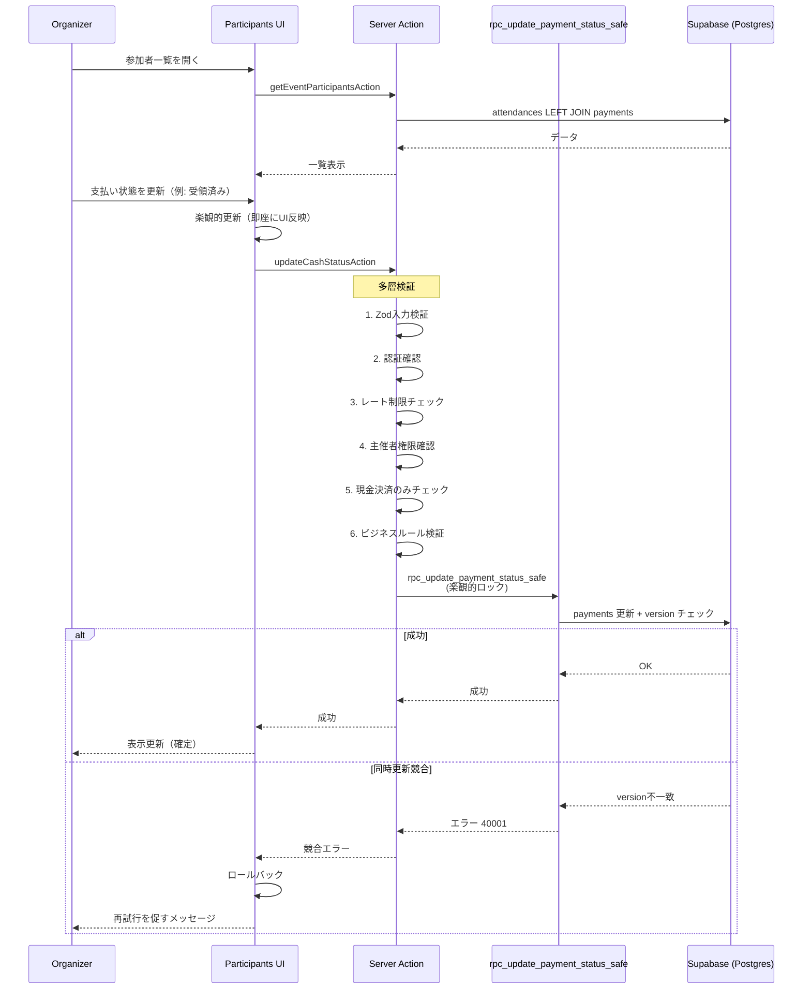

# 現金集金フロー（Cash Collection）

## 概要
本ドキュメントは、現金払い（cash）を選択した参加者に対して、主催者が「受領済み（received）」などの支払い状態を手動で更新するフローを説明する。
スコープ: 主催者UIでの更新 → Server Action/RPC → DB更新 → 画面反映（Stripe決済や返金は別ドキュメント）。

## Non-goals
- Stripe決済の確定（Webhook起点の非同期処理）は扱わない（`online-payment.md` を参照）。
- 返金のアプリ内UIは扱わない（運用はStripe側/別途手順）。
- ステータス一覧や状態遷移の"正"は `domain.md` / `data-model.md` とする。

## 前提
- 対象データ: `payments`（method = `cash`）
- 主催者権限: 更新できるのはイベント作成者（主催者）のみ、を前提に多層防御する（アプリ層 + DB/RLS/RPC）
- 典型更新: `pending`（集金待ち）→ `received`（受領済み）への変更を主に扱う

## 正常系フロー（主催者視点）

### 1. 参加者一覧の取得
1. 主催者が参加者管理画面を開く
2. UI は `getEventParticipantsAction` を呼び出す
3. Server Action は `attendances` と `payments` を **LEFT JOIN** で結合してデータを取得する
4. 取得したデータを UI に表示する

### 2. 現金決済状態の更新
1. 主催者が対象参加者を選び、支払い状態を「受領済み」等へ変更する
2. **UI側の楽観的更新**: サーバーからの応答を待たずに即座にUIを更新します（エラー時はロールバック）
3. `updateCashStatusAction` を呼び出します
4. Server Action は以下の検証を順次実行します:
   - **入力検証**: Zodスキーマによるバリデーション
   - **認証確認**: ユーザーがログインしているか確認
   - **レート制限チェック**: DoS攻撃の防止
   - **権限確認**: イベント主催者のみが更新可能
   - **現金決済のみチェック**: Stripe決済は手動更新不可（Webhookのみ）
   - **ビジネスルール検証**: ステータス遷移の妥当性を検証
5. **RPC関数の実行**: `rpc_update_payment_status_safe` を使用する
   - この関数は楽観的ロック（バージョン管理）を実装する
   - 同時更新の競合を検知し、エラーコード `40001` で返す
6. DB 更新が成功し、監査ログ（system logs）が記録する
7. UI は成功トースト表示と再検証（再取得/再描画）を行い、一覧を最新化する

### 一括更新
- `bulkUpdateCashStatusAction` を使用して複数件を一括更新する
- 1件更新と同様に「権限チェック」「整合性チェック」「ログ記録」を必須にします
- 1リクエストの上限（例: 50件）などの制約は、DoS回避とUXのために設ける（数値は実装を正とする）

### シーケンス図

## 整合性・例外（代表ケース）
- 対象が `cash` 以外（`stripe` 等）の支払いを手動更新しようとした場合は拒否する
  - Stripe決済は手動更新できず、Webhookによる自動更新のみ
- 既に確定済み相当の状態（例: `paid`/`refunded` 等）に対して不正な更新（降格など）が来た場合は拒否する
- 同時更新が競合した場合はエラーコード `40001`で検知され、ユーザーに再試行を促すメッセージが表示される

## 関連ドキュメント
- 主要フローの俯瞰: `../architecture.md`
- データモデル: `../data-model.md`（payments / enum / RLS / version 等）
- ドメイン: `../domain.md`（支払い状態の状態遷移・不変条件）
- セキュリティ: `../security.md`（RLS、監査ログ、レート制限等）
