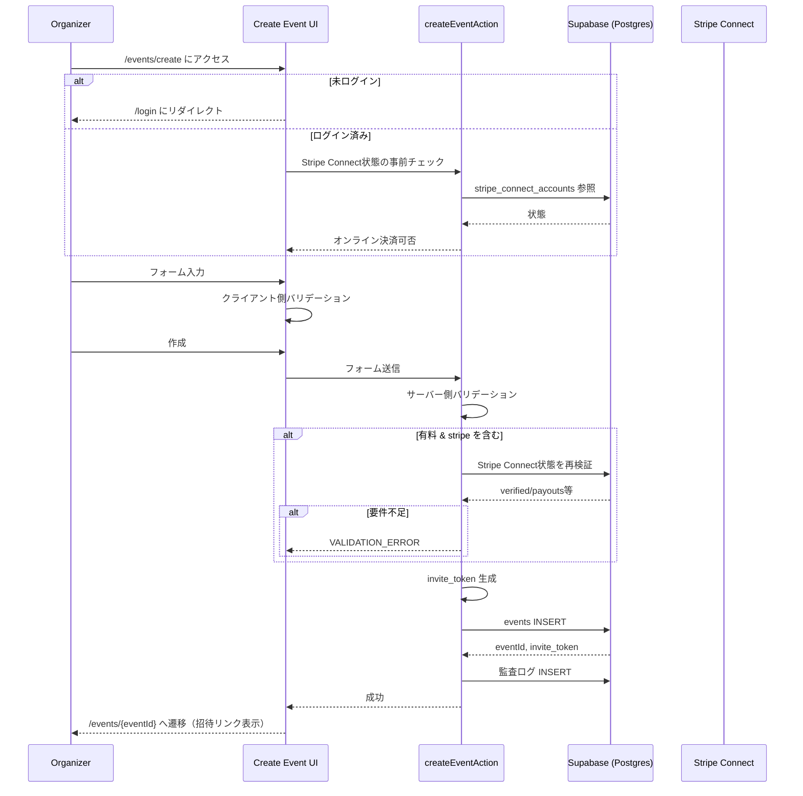

# イベント作成フロー（Create Event）

## 概要
本ドキュメントは、主催者がイベントを作成し、招待リンク（invite token）を共有可能な状態にするまでのフローを説明する。
スコープ: `/events/create` 表示 → 入力/検証 → DB保存 → 詳細ページ表示 → 招待リンク提示（RSVP/決済は別フロー）。

## Non-goals
- アプリ内の返金機能は扱わない（必要ならStripe側での運用を想定）。
- 複数料金（役職別、オプション、早割など）は扱わない（1イベント=1参加費）。

## 前提
- 主催者はログイン済みであること（未ログインなら `/login` へ誘導）。
- DBは Supabase PostgreSQL で、RLSにより主催者のイベントが保護される前提。
- オンライン決済（Stripe）を許可する場合、主催者側の Stripe Connect 状態が要件を満たす必要がある。

## 正常系フロー
1. 主催者が `/events/create` にアクセスする。
2. 未ログインならログインに誘導し、ログイン済みなら作成フォームを表示する。
3. UIは必要に応じて Stripe Connect 状態を参照し、「オンライン決済を選べるか」を事前に判断する（UX向上のための事前チェック）。
4. 主催者がフォーム入力し、クライアント側で即時バリデーションを行う。
5. 作成ボタン押下で Server Action（例: `createEventAction`）に送信し、サーバー側で再バリデーションを行う（改ざん対策）。
6. 有料かつ `stripe` を含む場合、サーバー側で Stripe Connect 状態を再検証し、要件未達なら作成を拒否する。
7. サーバー側で `invite_token` を生成し、`events` にINSERTする。
8. 作成成功後、イベント詳細ページ `/events/{eventId}` に遷移し、招待リンク（`/invite/{invite_token}`）を表示・コピー可能にする。

## 入力とバリデーション（要点）
- バリデーションは「クライアント（即時フィードバック）＋サーバー（最終判断）」の二重。
- 無料イベント（`fee = 0`）の場合は決済関連の値をサーバーで強制的に無効化し、クライアント改ざんの影響を排除する。
- 有料イベントで `payment_methods` に `stripe` を含める場合、`payment_deadline` 等の整合性チェックを必須にする（詳細な制約は validation / DB を正とする）。
- `capacity` は未指定を「無制限（null）」として扱うなど、UI表現とDB表現の差をサーバーで吸収する。

## データ更新（最小まとめ）
- `events`
  - 主催者（`created_by`）に紐づくイベントを作成し、招待用の `invite_token` を保存する。
- `system_logs`（または同等の監査ログ）
  - `event.create` 等の操作ログを保存し、後から追跡できるようにする（カテゴリ/actor等の設計は logging の正を参照）。

## 招待トークン生成（要点）
- `invite_token` は推測困難であることを前提に、暗号学的に安全な乱数から生成し、URLに埋め込める形式で保持する。
- トークンの長さ・正規表現・DB制約などの“正”は、token utility / validation / migrations に置き、本文では断定しすぎない運用にします。

## 編集制限（作成後）
イベント作成後は、参加状況や決済状況に応じて編集できない項目が発生する。
制限は「フロントでの無効化（UX）＋サーバーでの拒否（正）」の二重防御にする。
具体的な制限ルールは `event-edit-restrictions` のドメイン実装/READMEを正とする。

## シーケンス図（概略）

## 関連ドキュメント
- 俯瞰: `../architecture.md`
- データモデル: `../data-model.md`（events / invite_token / 制約）
- ドメイン: `../domain.md`（用語・状態・不変条件）
- セキュリティ: `../security.md`（RLS/脅威/運用）
- ADR: `../decisions/`（Stripe/ホスティング/冪等性などの背景）
