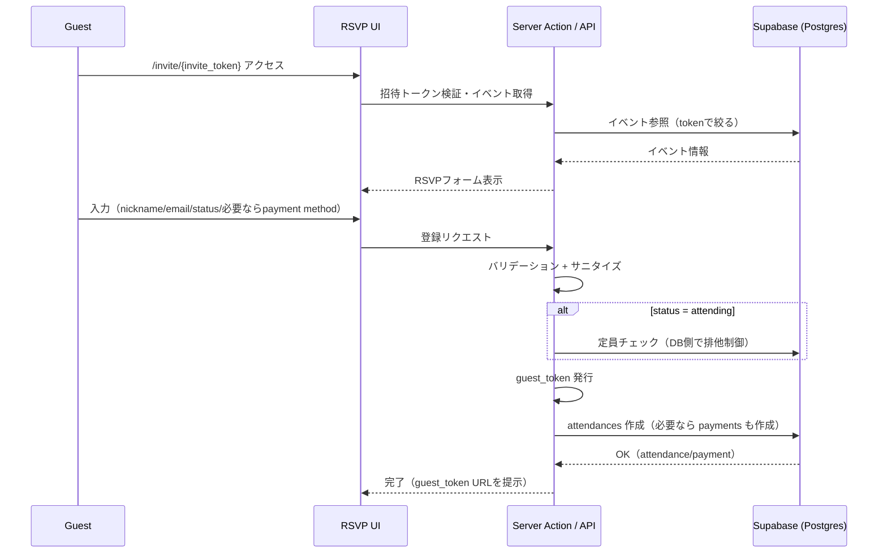

# ゲストRSVPフロー（Guest RSVP）

## 概要
本ドキュメントは、招待リンクからゲストが出欠（RSVP）を登録し、必要に応じて決済方法を選択し、後から変更するまでの処理フローを説明する。
スコープ: 招待リンク検証 → 初回RSVP登録 → ゲストトークンURLでの更新（オンライン決済の確定/Webhook処理は別ドキュメント）。

## Non-goals
- Stripe決済の確定（Webhook受信〜入金反映）はここでは扱わない（`online-payment.md` に分離）。
- 招待トークン/ゲストトークンの仕様（長さ・正規表現など）の断定は避け、正は token utility / validation / DB 制約とする。

## 登場人物と前提
- Guest: 招待リンク（`invite_token`）経由でイベントを閲覧し、RSVP登録するユーザー（アカウント不要）。
- System: Next.js（Server Actions / API Routes）+ Supabase（PostgreSQL + RLS）。
- 前提データ: `events`, `attendances`, `payments` が主要な永続化対象。
- 権限: ゲストは「自分の `guest_token` に紐づく Attendance/Payment」だけにアクセス可能という前提で設計する（詳細は `domain.md` / `data-model.md`）。

## 正常系フロー（初回登録）
1. Guest が招待リンク（例: `/invite/{invite_token}`）にアクセスする。
2. System は招待トークンの形式チェックと存在確認を行い、イベント情報を取得する。
3. System は登録可能かを判定する（キャンセル済み、締切超過、過去イベント等）。
4. Guest は RSVP フォームに入力する（nickname / email / attendance status、必要なら payment method）。
5. System は入力をバリデーションし、必要ならサニタイズする。
6. `attending` の場合のみ定員チェックを実施し、レースを避けるため DB 側でも排他制御（例: `FOR UPDATE`）を行う。
7. System は `guest_token` を発行し、DB に「参加（attendances）＋必要なら決済レコード（payments）」を作成する（原子的に作る場合は RPC を利用）。
8. System は登録完了画面を返し、ゲストトークンURL（例: `/guest/{guest_token}`）を案内する。
9. 可能なら登録完了通知メールを送信します（失敗しても登録自体は成功扱いにする、など運用方針に従う）。

### 初回登録のシーケンス図（概略）

## 正常系フロー（更新：ゲストトークン経由）
1. Guest がゲストトークンURL（`/guest/{guest_token}`）にアクセスする。
2. System は `guest_token` の形式チェックと存在確認を行い、該当 Attendance を取得する。
3. System は更新可能かを判定する（キャンセル済み、締切超過、過去イベント等）。
4. Guest は `attending` / `maybe` / `not_attending` を変更し、必要なら決済方法も選択する。
5. System はバリデーションし、`attending` へ変更する場合のみ定員チェックを行う。
6. System は DB を更新する（RPC を使う場合は `update_guest_attendance_with_payment` のような関数に集約）。

## データ更新（最小まとめ）
- `attendances`
  - 初回登録で作成し、更新時に `status` を更新する。
- `payments`
  - 有料かつ `attending` の場合に `pending` 等で作成/更新する。
  - `attending` 以外へ変更した場合、未確定の支払い（例: `pending` / `failed`）はキャンセル扱いに寄せる、などの方針を取る（詳細は `domain.md` / `data-model.md`）。

## 代表的なエラーケース
- 招待トークンが不正/存在しない → 404/エラー画面。
- 登録締切超過・イベント終了・キャンセル済み → 登録不可の理由を表示。
- 定員超過（attending のみ） → 「定員に達している」エラー。
- 同一イベント内でメール重複 → 「既に登録済み」エラー。
- 決済が確定した後の「決済方法変更」 → サーバー側で拒否（どの状態を確定とみなすかは `domain.md` を正とする）。

## セキュリティ・整合性の要点（このフローで重要なものだけ）
- トークンは推測困難であることを前提にしつつ、「形式チェック + DB存在確認」を必須とする。
- 定員は競合しやすいので、アプリ層の事前チェックだけでなく DB 側で排他制御して整合性を担保する。
- ゲスト更新は `guest_token` による本人性が中核なので、RLS もしくは SECURITY DEFINER + 追加検証など、多層で守る（詳細は `security.md` / `data-model.md`）。

## 関連ドキュメント
- アーキテクチャと主要フロー: `../architecture.md`（Flow 1: 招待→ゲスト出欠）
- ドメイン（用語、状態遷移、不変条件、権限モデル）: `../domain.md`
- データモデル（ERD、制約、RLS、冪等性）: `../data-model.md`
- セキュリティ（脅威モデル、RLS、Webhook等）: `../security.md`
- ADR（ゲスト招待リンクやRLS方針の背景）: `../decisions/`
