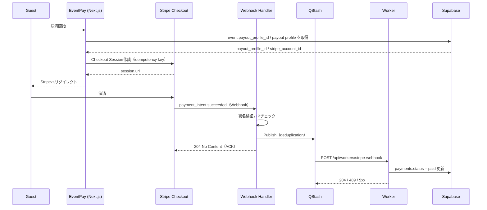

# オンライン決済フロー（Online Payment / Stripe）

## 概要
本ドキュメントは、ゲストが Stripe でオンライン決済を行い、Webhook を起点に非同期処理で DB の支払い状態を確定するまでのフローを説明する。
スコープ: Checkout Session 作成 → Stripe決済 → Webhook受付 → QStash経由のWorker処理 → `payments` の更新。

## Non-goals
- 返金のUI提供は扱わない（返金はStripe側操作を前提）。
- Stripe Connect のオンボーディング詳細や representative community の選択UIは扱わない。
- 料金計算（platform fee 等）の仕様詳細は、DB/ドメインの正を参照し、本ドキュメントでは“どこで使うか”に留める。

## 登場人物・コンポーネント
- Guest: RSVP後、オンライン決済を選択して支払う参加者。
- App（Next.js on Cloudflare Workers / OpenNext）: Checkout Session作成とWebhook受付を担当する。
- Stripe: Checkoutで決済をホストし、イベントをWebhookで通知します。
- QStash: Webhook処理をキューイングし、再試行や重複排除を担います。
- Worker（`/api/workers/stripe-webhook`）: 非同期でDB更新を実施します。
- Supabase（PostgreSQL + RLS）: `payments` 等の永続化と整合性を担います。

このフローで使う受取先の正本は user ではなく `event.payout_profile_id` です。Checkout 作成時は `event -> payout_profile -> stripe_account_id` で送金先を解決し、支払いレコードには `payments.payout_profile_id` を保存します。

## 正常系フロー
1. Guestが「オンライン決済（Stripe）」を選択して支払い開始する（前段のRSVP/Attendance作成は `guest-rsvp.md` を参照）。
2. Appは `createGuestStripeSessionAction` で対象 event の `payout_profile_id` を参照し、Stripe Checkout Sessionを作成して Guest を `session.url` にリダイレクトする。
3. GuestがStripe上で決済を完了すると、StripeはWebhookイベント（例: `payment_intent.succeeded`）を送信する。
4. Webhook Handlerは署名検証・IP等のチェックを行い、重いDB更新は行わず、QStashへイベント処理をPublishして `204 No Content` で即時ACKする。
5. QStashがWorker（`/api/workers/stripe-webhook`）を呼び出し、WorkerがDBの `payments.status` を `paid` に更新する。必要な payout 情報は `payments.payout_profile_id` を正とする。
6. Workerは処理結果を `204`（成功ACK）/ `489`（非リトライ）/ `5xx`（リトライ）で返す。

### シーケンス図（概略）

## 冪等性・重複排除（要点）
- Checkout Session作成はStripe APIの再試行を安全にするため、idempotency key を利用する。
- Webhook処理は「Webhook → QStash publish → WorkerでDB更新」に分離し、同一イベントの重複処理を避けるため deduplication id を用いる。
- DB側でも一意制約（例: Stripeの識別子やWebhook event id、Checkoutのキー等）を利用し、二重反映を防ぐ。
- 受取先は event / payment の payout snapshot を正とし、current community のデフォルト受取先変更で過去決済が揺れないようにする。

## 失敗時の扱い（要点）
- Webhook Handlerは“受け取った”ことを優先して `204` でACKし、後続はキューで再試行させる（Stripeの再送・タイムアウトと切り離すため）。
- Workerの応答で再試行方針を明示する。
  - `204`: 成功ACK（重複イベント・既処理を含む）
  - `489 + Upstash-NonRetryable-Error: true`: 恒久失敗（署名不正、JSON不正、必須項目欠落など）
  - `5xx`: 一時失敗（DB/外部依存の一時障害）
- キュー/Workerが最終的に失敗したメッセージはDLQ等に送って観測可能にする。
- 最終的な支払い状態は `payments.status` を正として扱い、UIは「pending → paid」の非同期確定を許容する。

## セキュリティ・観測（このフローで重要なもの）
- Stripe Webhookは署名シークレット（primary/secondary）を用いて検証し、許容タイムスタンプ範囲を設ける。
- QStashからの呼び出しは署名キーで検証する。
- 重要イベント（webhook/決済/セキュリティ）は構造化ログとして出力し、相関IDで追跡できるようにする。
- 成功時の相関情報（event id / message id / request id）はレスポンスボディではなくHTTPヘッダーで返す。

## 関連ドキュメント
- データモデル: `docs/data-model.md`（`events.payout_profile_id` / `payments.payout_profile_id` / 冪等性キー）
- ドメイン: `docs/domain.md`（payout profile / representative community / payment invariants）
- ADR: `docs/decisions/0005-payment-confirmation-and-idempotency.md`、`docs/decisions/0010-qstash-webhook-processing-and-observability.md`
