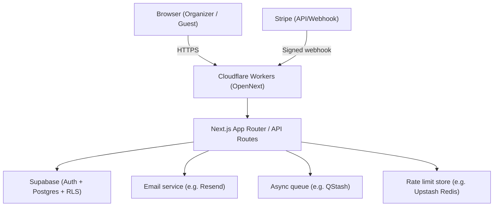

# セキュリティ

## 1. Scope / Assumptions

### 対象範囲
- Webアプリケーション（Next.js App Router）および関連API/Webhook。
- DB/認証基盤（Supabase: PostgreSQL + Auth + RLS）。
- 決済（Stripe / Stripe Connect）。
- 実行環境（Cloudflare Workers / OpenNext）およびキャッシュ（R2利用がある場合）。

### 非対象（この文書で扱わない）
- UIの細部・デザイン・全テーブルの完全なERD（別ドキュメントで管理）。
- Cloudflare/Supabase/Stripe等、外部SaaSの内部実装（提供側責任）。

### 前提
- 本番はHTTPSでの提供を前提とする。
- 外部サービス連携は「最小権限」「最小データ」を原則とする。

## 2. Security Goals

- **機密性**: PII・トークン・シークレット等の漏洩を防ぐ。
- **完全性**: 出欠・決済ステータス等の改竄を防ぐ（特に決済確定）。
- **可用性**: レート制限等で濫用・DoSに耐える。
- **監査性**: 重要操作・セキュリティイベントを追跡可能にする。

## 3. Assets / Data Classification

### Critical（最重要）
- 認証/セッション関連データ（JWT、セッション識別子、招待トークン等）。
- 決済関連データ（StripeのID、金額、決済状態、Connect関連の識別子）。
- シークレット（Stripe/Supabase/Redis/メール等のAPIキー、署名検証用シークレット）。

### Sensitive（準機密）
- PII（メールアドレス、表示名、参加者情報など）。
- イベントの内部情報（招待リンクで閲覧可能な範囲を含む）。

### Public（公開可能）
- ランディング上の説明、利用規約・プライバシーポリシー等の公開文書。

## 4. Trust Boundaries

データフロー上の「信頼境界」を明確にし、境界を越える入力は“すべて不正になり得る”前提で扱う。

## 5. Threat Model

脅威は代表例を列挙し、対策は「どこで」「何を」防ぐかを対応付ける。

| 脅威 | 影響 | 主な対策（概要） |
|---|---|---|
| XSS | セッション/データ窃取、なりすまし | CSP、入力検証/サニタイズ、危険なHTMLの排除。 |
| CSRF | 意図しない状態変更 | Cookie方針、状態変更の保護（フレームワーク機構＋追加対策の検討）。 |
| Injection（SQL等） | DB侵害、改ざん | パラメータ化、RLS、入力検証。 |
| 認可不備（IDOR等） | 他ユーザー情報閲覧/改ざん | RLS、サーバー側の所有権チェック、テストで担保。 |
| Webhook偽装/リプレイ | 決済状態の不整合/改ざん | 署名検証、冪等性、再送/重複処理の安全化。 |
| レート制限回避/DoS | 可用性低下、スパム | レート制限、WAF/Firewall（運用）、異常検知。 |
| シークレット漏洩 | 全権侵害 | シークレット管理、ログ禁止、ローテーション、最小権限。 |

## 6. Authentication

- 認証は Supabase Auth を中心に行う。
- 外部IdP（例: LINEログイン）が有効な場合も、サーバー側で“最終的なユーザー同定”を行う。
- ゲスト参加（招待リンク等）がある場合、トークンは「推測困難」「漏洩時の影響最小化」「失効・再発行」を満たす設計にする。

## 7. Authorization / Access Control

- DBレベルの行単位制御（RLS）を“防御の中核”として扱う。
- アプリ層でも「所有者チェック」「入力検証」「ユースケース単位の権限」を重ね、単一層依存を避ける。
- 高権限キー（例: service role 相当）の利用は最小化し、使用箇所は監査可能にする。

## 8. Web Security Controls

- CSPはXSS対策の柱であり、例外を最小化する。
- 入力値は保存前・利用前に検証し、ログには危険文字列をそのまま残さないようにする（ログインジェクション対策）。
- レート制限は認証・決済・招待リンク等の濫用されやすい入口を中心に設計する。
- 追加のヘッダー（HSTS等）は「実装が存在する場合のみ」この文書に記載し、断定を避ける。

## 9. Payments & Webhooks Security

- 決済は Stripe を利用し、アプリ側は「金額・対象イベント・支払い者」を正規化して扱う。
- Webhookは署名検証を必須とし、検証に失敗したイベントは状態更新しない。
- Webhookはリトライ/再送が起こり得るため、処理は冪等に設計する（同一イベントを複数回受けても結果が壊れない）。
- Stripe Connect を使う場合、口座/オンボーディング情報は必要最小限の保持に留める。

## 10. Secrets & Configuration

- シークレットはログに出さないを原則とする。
- シークレットは環境変数で注入し、ローカル（`.env.local`）と本番（Workers環境変数）を分離する。
- ローテーション（Webhook secret / 署名鍵等）を前提に、複数キー併用期間を許容する設計が望ましい。

## 11. Logging / Monitoring / Alerting

### 記録すべきイベント（例）
- ログイン成功/失敗、権限不足、入力検証失敗、Webhook検証失敗、レート制限発火など。
- 重要操作（イベント作成/編集、支払い状態更新、返金・取消に相当する操作）。

### 記録しない（またはマスク/ハッシュ化する）べき情報（例）
- パスワード、アクセストークン、セッションID、主要シークレット、過度に詳細なPII等。

### 監視・通知
- 分散環境ではログを集約し、改竄検知やアクセス制御も考慮する。
- 重大イベントは通知（例: エラー監視サービス、Slack等）へ送る。

## 12. Incident Response（最小Runbook）

- まず「影響範囲（誰に/どの機能に）」「再現条件」「ログの相関キー（request id等）」を確定する。
- シークレット漏洩の疑いがある場合、最優先はキーのローテーションと影響範囲の特定。
- 決済/Webhookは、プロバイダ側（Stripe）の再送機能やイベント履歴を活用して復旧する。

## 13. Security Testing

- セキュリティ要件はテストで“継続的に検証可能”な形に落とす。
- 例: 署名不正Webhookが拒否される、RLSで他人の行が読めない、レート制限が期待通り動作する、などをテスト化する。
