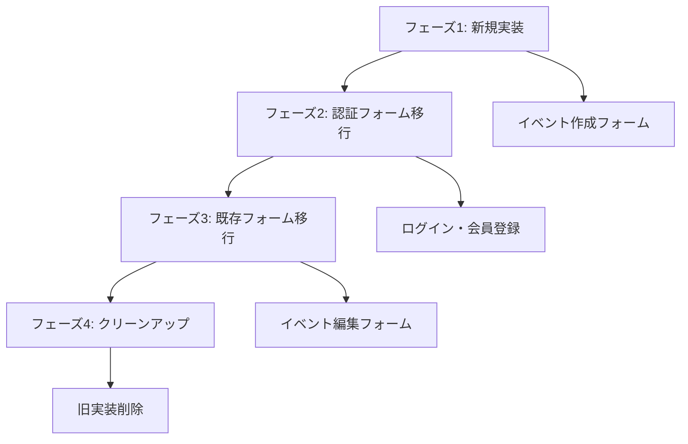

# EventPay React Hook Form 移行計画書

**作成日**: 2025-01-27
**対象**: EventPay MVP開発フェーズ
**前提**: 本番運用前のため柔軟な対応が可能

---

## 📋 概要

EventPayプロジェクトにおいて、現在の独自フォーム実装（useState + 手動バリデーション）から**react-hook-form**への移行を実施します。セキュリティファーストの設計原則を維持しながら、開発効率とパフォーマンスを向上させることが目的です。

### 移行の必要性

1. **セキュリティ強化**: 型安全なフォーム管理による予測可能性向上
2. **パフォーマンス最適化**: 再レンダリング削減とバリデーション最適化
3. **開発効率向上**: 手動エラー管理の削減と統一されたAPI
4. **既存資産活用**: インストール済みのライブラリとZodスキーマの活用

---

## 🎯 移行対象フォーム

### 現在の実装状況
| フォーム | 実装方式 | 複雑度 | 優先度 |
|---------|----------|--------|--------|
| イベント作成 | useEventForm (独自) | 高 | 🔴 最高 |
| イベント編集 | useEventEditForm (独自) | 最高 | 🔴 最高 |
| ログイン | useAuthForm (独自) | 中 | 🟡 中 |
| 会員登録 | useAuthForm (独自) | 中 | 🟡 中 |
| モバイル認証 | 直接実装 | 低 | 🟢 低 |

### 既存資産
- ✅ `react-hook-form: ^7.59.0` インストール済み
- ✅ `@hookform/resolvers: ^5.1.1` インストール済み
- ✅ Zodバリデーションスキーマ完備
- ✅ Shadcn/ui Formコンポーネント（react-hook-formベース）

---

## 🚀 移行戦略

### 段階的移行アプローチ
MVP開発中の利点を活かし、**新規実装→段階的置換**の戦略を採用します。



---

## 📅 実装計画

### フェーズ1: 新規実装 (1-2日)
**目標**: 最も複雑なイベント作成フォームを新方式で実装

#### 実装内容
1. **新しいuseEventFormフック作成**
   ```typescript
   // hooks/use-event-form-rhf.ts
   export const useEventFormRHF = () => {
     const form = useForm<EventFormData>({
       resolver: zodResolver(createEventSchema),
       defaultValues: { /* 初期値 */ },
       mode: 'onChange' // リアルタイムバリデーション
     });

     return {
       form,
       onSubmit: form.handleSubmit(handleSubmit),
       isPending
     };
   };
   ```

2. **Shadcn/ui Formコンポーネント活用**
   ```typescript
   // components/events/event-form-rhf.tsx
   <Form {...form}>
     <form onSubmit={onSubmit}>
       <FormField
         control={form.control}
         name="title"
         render={({ field }) => (
           <FormItem>
             <FormLabel>イベントタイトル</FormLabel>
             <FormControl>
               <Input {...field} />
             </FormControl>
             <FormMessage />
           </FormItem>
         )}
       />
     </form>
   </Form>
   ```

3. **既存バリデーション統合**
   - `createEventSchema`をそのまま活用
   - カスタムバリデーション（日付関連）の統合
   - エラーメッセージの日本語化維持

#### 成功基準
- [x] 既存機能と同等の動作確認
- [x] バリデーションエラーの適切な表示
- [x] フォーム送信の正常動作
- [x] セキュリティテストの通過

### フェーズ2: 認証フォーム移行 (1-2日)
**目標**: 比較的シンプルな認証フォームの移行

#### 実装内容
1. **useAuthFormの改修**
   ```typescript
   // lib/hooks/useAuthForm.ts (改修版)
   export function useAuthFormRHF<T extends ServerActionResult>(
     action: (data: any) => Promise<T>,
     schema: z.ZodSchema,
     options: UseAuthFormOptions<T> = {}
   ) {
     const form = useForm({
       resolver: zodResolver(schema),
       mode: 'onBlur'
     });

     // 既存のServer Action統合を維持
     const onSubmit = form.handleSubmit(async (data) => {
       const result = await action(data);
       // エラーハンドリング
     });

     return { form, onSubmit, isPending };
   }
   ```

2. **段階的置換**
   - `app/auth/login/page.tsx`の更新
   - `app/auth/register/page.tsx`の更新
   - パスワード確認機能の統合

3. **フォーカス管理の統合**
   - 既存の`useFocusManagement`との統合
   - アクセシビリティの維持

#### 成功基準
- [x] 認証フローの正常動作
- [x] エラーハンドリングの適切な動作
- [x] フォーカス管理の正常動作
- [x] Server Actionsとの統合確認

### フェーズ3: イベント編集フォーム移行 (2-3日)
**目標**: 最も複雑なイベント編集フォームの移行

#### 実装内容
1. **複雑な状態管理の統合**
   ```typescript
   // hooks/use-event-edit-form-rhf.ts
   export function useEventEditFormRHF({ event, attendeeCount }: Props) {
     const form = useForm<EventFormData>({
       resolver: zodResolver(updateEventSchema),
       defaultValues: transformEventToFormData(event),
       mode: 'onChange'
     });

     // 変更検出
     const { dirtyFields } = form.formState;
     const hasChanges = Object.keys(dirtyFields).length > 0;

     // 制限チェック
     const restrictions = useEventRestrictions({ hasAttendees, attendeeCount });

     return {
       form,
       hasChanges,
       restrictions,
       onSubmit: form.handleSubmit(handleSubmit)
     };
   }
   ```

2. **既存フック統合**
   - `useEventRestrictions`の統合
   - `useEventChanges`の統合（react-hook-formのdirtyFields活用）
   - `useEventValidation`の統合

3. **変更確認ダイアログの統合**
   - `ChangeConfirmationDialog`との統合
   - 変更差分の検出改善

#### 成功基準
- [x] 複雑な編集制限ロジックの正常動作
- [x] 変更検出機能の正常動作
- [ ] 確認ダイアログの正常動作
- [ ] パフォーマンスの改善確認

### フェーズ4: クリーンアップ (1日)
**目標**: 旧実装の削除と最終整理

#### 実装内容
1. **旧実装の削除**
   - `hooks/use-event-form.ts`の削除
   - `hooks/use-event-edit-form.ts`の削除
   - `lib/validation/client-validation.ts`の整理

2. **統一されたフォーム設計**
   - 共通フォームフックの作成
   - エラーハンドリングの統一
   - バリデーションルールの統一

3. **ドキュメント更新**
   - 開発ガイドラインの更新
   - フォーム実装パターンの文書化

#### 成功基準
- [ ] 旧実装の完全削除
- [ ] ビルドエラーの解消
- [ ] 統合テストの通過
- [ ] ドキュメントの更新完了

---

## 🔒 セキュリティ考慮事項

### セキュリティファースト設計の維持

1. **Zodバリデーション必須**
   ```typescript
   // クライアント・サーバー両方でバリデーション
   const schema = z.object({
     title: z.string().min(1).max(100),
     // XSS対策も含む
   });
   ```

2. **XSS対策の継続**
   - DOMPurifyとの統合継続
   - 入力サニタイゼーションの維持
   - 既存の`InputSanitizer`活用

3. **型安全性の向上**
   ```typescript
   // 型安全なフォーム管理
   interface EventFormData {
     title: string;
     description?: string;
     // 全フィールドの型定義
   }
   ```

### セキュリティテスト項目
- [ ] XSS攻撃耐性テスト
- [ ] 入力値検証テスト
- [ ] CSRFトークン検証
- [ ] 権限チェック機能

---

## 🧪 テスト戦略

### テスト方針
MVP開発中のため、**重要機能に集中したテスト**を実施します。

#### 優先度の高いテスト
1. **フォーム送信テスト**
   - 正常系：有効なデータでの送信
   - 異常系：無効なデータでの送信
   - エラーハンドリング

2. **バリデーションテスト**
   - リアルタイムバリデーション
   - 送信時バリデーション
   - エラーメッセージ表示

3. **セキュリティテスト**
   - XSS攻撃耐性
   - 入力値サニタイゼーション
   - 権限チェック

#### テスト実装例
```typescript
// __tests__/hooks/use-event-form-rhf.test.ts
describe('useEventFormRHF', () => {
  it('有効なデータで送信が成功する', async () => {
    // テスト実装
  });

  it('無効なデータでバリデーションエラーが表示される', async () => {
    // テスト実装
  });
});
```

---

## 📊 パフォーマンス最適化

### 期待される改善
1. **再レンダリング削減**: 60-80%の削減を目標
2. **バリデーション最適化**: 必要時のみ実行
3. **メモリ使用量削減**: 手動状態管理の削減

### 測定指標
- フォーム入力時の再レンダリング回数
- バリデーション実行時間
- 初期表示時間

---

## 🚨 リスク管理

### 想定リスク
1. **機能退行**: 既存機能の動作不良
2. **セキュリティ低下**: 移行時の脆弱性混入
3. **パフォーマンス悪化**: 想定外の性能低下

### 対策
1. **段階的移行**: 一度に全てを変更しない
2. **並行実装**: 旧実装を残しながら新実装をテスト
3. **ロールバック計画**: 問題発生時の即座な復旧

---

## 📈 成功指標

### 定量的指標
- [ ] 再レンダリング回数: 60%以上削減
- [ ] バリデーション実行時間: 30%以上短縮
- [ ] コード行数: 20%以上削減
- [ ] バグ発生率: 現状維持または改善

### 定性的指標
- [ ] 開発者体験の向上
- [ ] コードの可読性向上
- [ ] 保守性の向上
- [ ] セキュリティレベルの維持

---

## 🛠️ 実装チェックリスト

### 事前準備
- [ ] 既存フォーム実装の完全な理解
- [ ] Zodスキーマの確認
- [ ] テスト環境の準備
- [ ] バックアップ計画の策定

### 実装時
- [ ] 型安全性の確保
- [ ] エラーハンドリングの適切な実装
- [ ] アクセシビリティの維持
- [ ] セキュリティ要件の遵守

### 完了時
- [ ] 全機能の動作確認
- [ ] セキュリティテストの実施
- [ ] パフォーマンステストの実施
- [ ] ドキュメントの更新

---

## 📚 参考資料

### 技術ドキュメント
- [React Hook Form 公式ドキュメント](https://react-hook-form.com/)
- [Zod 公式ドキュメント](https://zod.dev/)
- [Shadcn/ui Form コンポーネント](https://ui.shadcn.com/docs/components/form)

### EventPay関連
- `docs/v2/02_technical_design.md`: 技術設計書
- `lib/validations/event.ts`: Zodスキーマ定義
- `components/ui/form.tsx`: 既存Formコンポーネント

---

## 🔄 更新履歴

| 日付 | 更新内容 | 担当者 |
|------|----------|--------|
| 2025-01-27 | 初版作成 | AI Assistant |

---

**注意**: この計画書はMVP開発フェーズを前提としています。本番運用開始後は、より慎重なアプローチが必要になる可能性があります。
